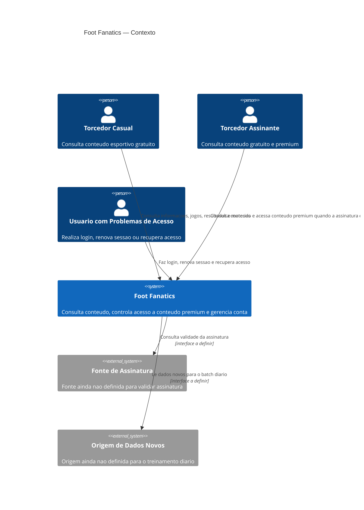
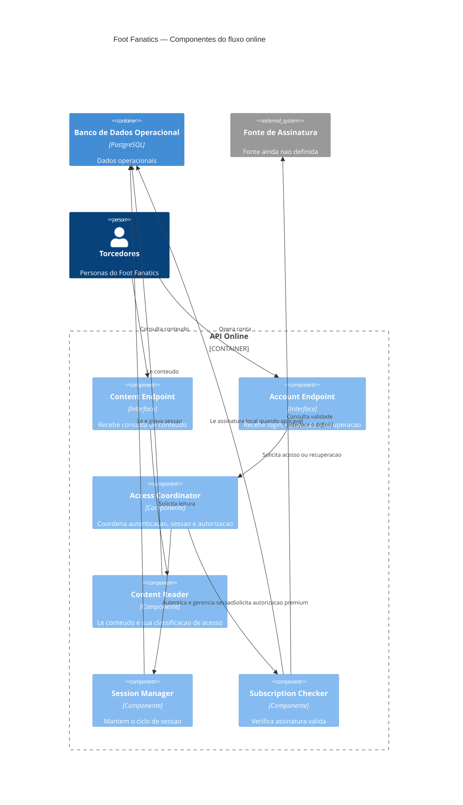
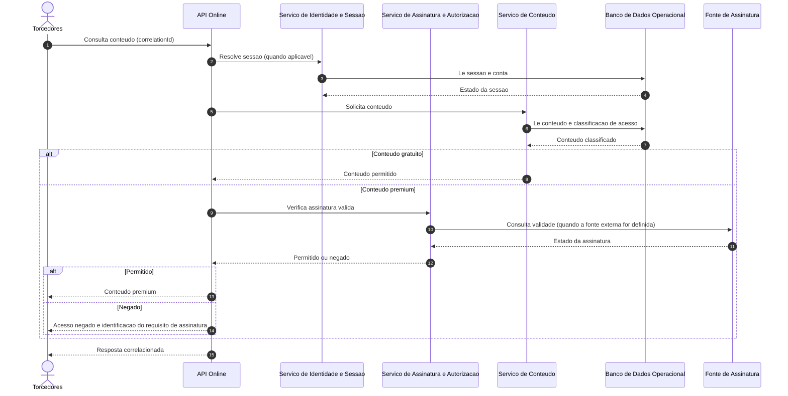
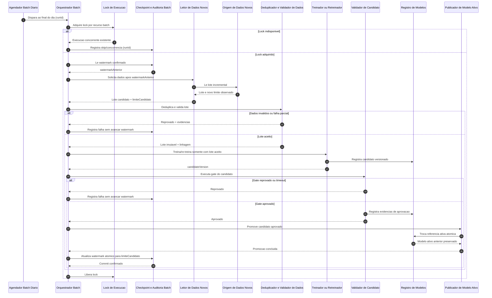

# Foot Fanatics — Base factual da arquitetura

## 1. Contexto e objetivo

O Foot Fanatics e um produto para consulta de informacoes esportivas, jogos,
resultados e materias sobre clubes de interesse. O contexto confirmado e o de
acesso ocasional por torcedores casuais e uso frequente por torcedores
assinantes. Tambem existe a necessidade de acesso seguro a conta, renovacao de
sessao e recuperacao de acesso.

Este documento organiza os fatos disponiveis para orientar a arquitetura. Ele
nao define componentes, fluxos, volumes, tecnologias adicionais, SLAs,
integracoes ou metricas que nao estejam nos artefatos consultados.

## 2. Stakeholders e personas

As personas abaixo foram preservadas de `docs/prd.md`.

### Persona 1 — Torcedor Casual

- **Objetivo:** acompanhar informacoes, jogos, resultados e materias sobre seus
	clubes de interesse.
- **Contexto:** acessa o Foot Fanatics ocasionalmente para consultar conteudo
	esportivo disponivel gratuitamente.
- **Frustracao:** encontrar barreiras de acesso em conteudos que deveriam estar
	disponiveis gratuitamente ou ter dificuldade para identificar quais conteudos
	exigem assinatura.

### Persona 2 — Torcedor Assinante

- **Objetivo:** acessar conteudos esportivos exclusivos e acompanhar clubes,
	jogos, resultados e materias disponiveis para assinantes.
- **Contexto:** possui uma assinatura premium e utiliza o Foot Fanatics com
	frequencia, esperando ter acesso aos conteudos exclusivos enquanto sua
	assinatura estiver valida.
- **Frustracao:** ter uma assinatura ativa e, mesmo assim, nao conseguir
	acessar conteudos premium por problemas de autenticacao, sessao ou
	reconhecimento da assinatura.

### Persona 3 — Usuario com Problemas de Acesso

- **Objetivo:** acessar sua conta de forma segura e recuperar o acesso quando
	tiver problemas com suas credenciais ou sessao.
- **Contexto:** ja possui uma conta no Foot Fanatics e precisa realizar login,
	renovar sua sessao ou recuperar o acesso a conta.
- **Frustracao:** nao conseguir entrar na conta, ter sua sessao encerrada
	inesperadamente ou encontrar dificuldades para recuperar o acesso.

## 3. Fontes de verdade consultadas

Foram consultados integralmente os seguintes artefatos do repositorio:

- `docs/prd.md`: personas do produto. Nao contem IDs de requisitos, regras de
	negocio, restricoes ou decisoes.
- `docs/plano-de-teste.md`: estrategia, niveis, criterios, metas de cobertura e
	ambiente de teste ainda marcados como `TODO`.
- `docs/arquitetura.md`: stack previamente declarada; demais secoes estavam
	como `TODO` antes desta atualizacao.
- `README.md`: apenas o nome do repositorio, sem requisitos do produto.
- `AGENTS.md`: regra de processo que orienta a nao inventar requisitos; nao e
	especificacao funcional do Foot Fanatics.

Os documentos de framework em `.aiox-core/` e `.claude/` foram tratados como
regras de trabalho do repositorio, nao como fonte de requisitos do produto.

## 4. Requisitos arquiteturalmente significativos

Nao ha IDs `RF-*`, `RNF-*` ou outros identificadores de requisitos nos
artefatos do produto. Os itens abaixo sao necessidades explicitas ou
restricoes fornecidas, com sua origem rastreavel.

| ID local | Requisito/necessidade | Impacto arquitetural | Origem | Status |
| --- | --- | --- | --- | --- |
| AS-01 | Disponibilizar informacoes, jogos, resultados e materias para consulta. | O sistema precisa representar e servir esses tipos de conteudo. O mecanismo de armazenamento e consulta nao foi definido. | `docs/prd.md`, Persona 1 — Objetivo | Fato confirmado |
| AS-02 | Diferenciar conteudo gratuito de conteudo que exige assinatura. | O acesso precisa considerar a classificacao de acesso do conteudo e torna-la identificavel ao usuario. O modelo e o fluxo nao foram definidos. | `docs/prd.md`, Persona 1 — Frustracao | Fato confirmado |
| AS-03 | Permitir acesso a conteudo exclusivo para assinantes com assinatura valida. | A autorizacao precisa considerar a validade da assinatura. Integracao, estados e fonte da assinatura nao foram definidos. | `docs/prd.md`, Persona 2 — Objetivo e Contexto | Fato confirmado |
| AS-04 | Suportar login, renovacao de sessao e recuperacao de acesso. | Exige capacidades de identidade, sessao e recuperacao; protocolos, tokens e canais nao foram definidos. | `docs/prd.md`, Persona 3 — Contexto e Objetivo | Fato confirmado |
| AS-05 | Proteger o acesso a conta. | Seguranca e controle de acesso sao preocupacoes arquiteturais explicitas; requisitos verificaveis nao foram especificados. | `docs/prd.md`, Persona 3 — Objetivo | Fato confirmado; detalhamento pendente |
| AS-06 | Executar diariamente, ao final do dia, treinamento ou retreinamento usando somente dados novos. | Exige um agendamento diario e uma estrategia de selecao de dados novos. O horario, fuso, mecanismo de treino, armazenamento do modelo, criterio de retreino e tratamento de falha nao foram definidos. | Restricao fornecida pelo professor | Restricao obrigatoria externa |
| AS-07 | Usar Java 21, Spring Boot 3.x, PostgreSQL e Maven. | Limita as escolhas de implementacao e persistencia da solucao. | `docs/arquitetura.md` (stack preexistente) | Fato confirmado como decisao existente; justificativa ausente |

## 5. Atributos de qualidade

Nao foram definidos RNFs, metas ou metricas nos artefatos. Portanto, os itens
abaixo nao sao compromissos de qualidade; sao preocupacoes derivadas de fatos
explícitos e devem ser transformadas em requisitos verificaveis antes da
implementacao.

| Atributo | Evidencia/origem | O que falta definir |
| --- | --- | --- |
| Seguranca | A Persona 3 exige acesso seguro; a Persona 2 relata falhas de autenticacao e sessao. Origem: `docs/prd.md`, Personas 2 e 3. | Requisitos de autenticacao, autorizacao, recuperacao, protecao de credenciais e metas de seguranca. |
| Disponibilidade de acesso autorizado | A Persona 2 espera acessar conteudo premium enquanto a assinatura estiver valida. Origem: `docs/prd.md`, Persona 2 — Contexto. | Janela de disponibilidade, comportamento em falhas e SLA. |
| Confiabilidade de sessao e assinatura | As frustracoes citam encerramento inesperado de sessao e nao reconhecimento da assinatura. Origem: `docs/prd.md`, Personas 2 e 3 — Frustracoes. | Regras de expiracao/renovacao, consistencia da validade e metricas de erro. |
| Atualidade do treinamento | A restricao externa determina uso somente de dados novos em execucao diaria. Origem: restricao fornecida pelo professor. | Definicao operacional de dado novo, janela temporal e criterio de sucesso. |

## 6. Drivers priorizados

Prioridade qualitativa baseada na evidencia disponivel, nao em uma metrica
formal:

1. **Acesso correto ao conteudo:** diferencia gratuidade de assinatura e
	 entrega conteudo premium a assinantes validos. Origem: `docs/prd.md`,
	 Personas 1 e 2.
2. **Acesso a conta:** login, sessao e recuperacao precisam atender a persona
	 com problemas de acesso. Origem: `docs/prd.md`, Persona 3.
3. **Seguranca da conta:** o acesso deve ser seguro. Origem: `docs/prd.md`,
	 Persona 3.
4. **Rotina diaria de treinamento com dados novos:** restricao obrigatoria da
	 atividade. Origem: restricao fornecida pelo professor.
5. **Aderencia a stack declarada:** Java 21, Spring Boot 3.x, PostgreSQL e
	 Maven. Origem: `docs/arquitetura.md` preexistente.

## 7. Glossario

- **Conteudo gratuito:** conteudo esportivo que, segundo a Persona 1, deve
	estar disponivel sem assinatura. A regra detalhada de classificacao nao foi
	definida.
- **Conteudo premium/exclusivo:** conteudo disponivel para assinantes segundo a
	Persona 2.
- **Assinatura valida:** assinatura que, segundo a Persona 2, permite acesso ao
	conteudo exclusivo. Estados e fonte de verdade nao foram definidos.
- **Sessao:** estado de acesso autenticado do usuario; duracao, renovacao e
	expiracao nao foram definidas.
- **Dados novos:** dados elegiveis para o treinamento diario conforme a
	restricao fornecida pelo professor. A definicao operacional esta em aberto.
- **Treinamento/retreinamento:** processamento diario mencionado na restricao
	externa. Objetivo, algoritmo e artefatos produzidos nao foram definidos.

## 8. Fatos, lacunas, conflitos, suposicoes e perguntas abertas

### Fatos confirmados

- Existem tres personas: Torcedor Casual, Torcedor Assinante e Usuario com
	Problemas de Acesso, descritas em `docs/prd.md`.
- O produto envolve informacoes, jogos, resultados, materias, conteudo gratuito
	e conteudo exclusivo para assinantes.
- Login, renovacao de sessao e recuperacao de acesso fazem parte do contexto
	da Persona 3.
- A stack declarada e Java 21, Spring Boot 3.x, PostgreSQL e Maven.
- A atividade exige um cron job diario no final do dia para treinar ou
	retreinar usando somente dados novos.

### Lacunas

- Nao ha requisitos funcionais ou nao funcionais identificados por IDs.
- Nao ha regras de negocio formais para assinatura, classificacao de conteudo,
	expiracao ou recuperacao de acesso.
- Nao ha modelo de dados, camadas, APIs, integracoes ou componentes definidos.
- Nao ha volumes, carga, SLA, metas de cobertura, ambiente de teste ou
	estrategia de testes definidos; `docs/plano-de-teste.md` esta em `TODO`.
- Nao ha detalhes do treinamento, dos dados, do modelo, do armazenamento ou do
	monitoramento do job diario.
- Nao ha ADRs ou justificativas para a stack declarada.

### Conflitos

- Nenhum conflito foi encontrado entre `docs/prd.md`, `docs/arquitetura.md` e
	`docs/plano-de-teste.md`.
- A exigencia do cron job diario e o uso exclusivo de dados novos nao aparecem
	nos artefatos consultados. Tambem nao contradizem um requisito existente. Sua
	origem deve ser registrada como **restricao fornecida pelo professor**, e nao
	como requisito previamente levantado.

### Suposicoes

- Nenhuma suposicao de arquitetura, tecnologia, fluxo, volume ou metricas foi
	promovida a fato neste documento.
- A prioridade dos drivers na secao 6 e uma ordenacao analitica provisoria,
	baseada nas personas, nao uma prioridade de negocio formalmente aprovada.

### Perguntas abertas

- Quais sao os requisitos funcionais e nao funcionais formais e seus IDs?
- Quais regras determinam conteudo gratuito, premium e assinatura valida?
- Qual e a fonte de verdade da assinatura e existe alguma integracao externa?
- Quais sao os fluxos e requisitos de login, renovacao de sessao e recuperacao?
- Qual e o horario exato, fuso e comportamento de retry do cron job?
- Como identificar e impedir a reutilizacao de dados ja usados no treinamento?
- O job sempre treina ou decide entre treinar e retreinar por algum criterio?
- Onde ficam armazenados dados, modelos e resultados do processamento?
- Quais volumes, picos, metas de desempenho, disponibilidade e seguranca devem
	ser atendidos?
- Quais decisoes justificam a stack Java 21, Spring Boot 3.x, PostgreSQL e
	Maven?
- Quais testes, ambientes e metas de cobertura serao definidos no plano de
	teste?

## 9. Riscos arquiteturais iniciais

| Risco | Evidencia | Consequencia potencial | Mitigacao a definir |
| --- | --- | --- | --- |
| Autorizacao inconsistente | Acesso premium depende de assinatura valida, mas nao ha regra nem fonte de assinatura. | Conceder acesso indevido ou bloquear assinantes validos. | Definir fonte de verdade, estados e verificacoes de autorizacao. |
| Sessoes pouco confiaveis | Personas citam encerramento inesperado, falhas de autenticacao e recuperacao. | Perda de acesso e frustracao recorrente. | Especificar ciclo de vida da sessao e cenarios de recuperacao. |
| Seguranca insuficientemente especificada | Acesso seguro e objetivo explicito, sem RNF ou controles definidos. | Exposicao de contas ou dados. | Elaborar requisitos de seguranca verificaveis antes da implementacao. |
| Job diario nao reproduzivel | A restricao exige somente dados novos, mas nao define identificacao, janela ou idempotencia. | Dados repetidos, dados omitidos ou modelos inconsistentes. | Definir contrato de novidade, registro de processamento e falhas. |
| Stack sem decisao documentada | A stack existe no rascunho, sem ADR ou justificativa. | Decisoes futuras desalinhadas ou dificuldade de manutencao. | Registrar justificativas e limites quando os requisitos forem detalhados. |
| Qualidade nao mensuravel | Plano de teste e RNFs estao sem metas. | Impossibilidade de avaliar prontidao e regressao. | Completar o plano de teste com criterios rastreaveis aos requisitos. |

## 10. Decisoes (ADR)

Nenhum ADR foi encontrado nos artefatos consultados. A stack registrada na
secao 1 e uma decisao preexistente, mas sua motivacao e seus trade-offs sao
lacunas. Nao ha base factual para registrar outras decisoes arquiteturais
neste momento.

## 11. Proposta de limites e responsabilidades

Esta secao e uma concepcao arquitetural orientada pelos drivers, nao uma
descricao de componentes ja existentes. Os nomes usados aqui sao os mesmos
utilizados nos diagramas das secoes seguintes.

### Fluxo online

- **Cliente do Foot Fanatics:** inicia consultas de conteudo, login, renovacao
	de sessao e recuperacao de acesso. Pode representar Torcedor Casual,
	Torcedor Assinante ou Usuario com Problemas de Acesso.
- **API Online:** expoe as interfaces de conteudo e conta, correlaciona cada
	requisicao e coordena autenticacao, sessao, assinatura e autorizacao.
- **Servico de Conteudo:** consulta informacoes, jogos, resultados e materias;
	informa se o conteudo e gratuito ou premium.
- **Servico de Identidade e Sessao:** executa login, renovacao e recuperacao de
	acesso, sem definir neste documento protocolo, token ou canal.
- **Servico de Assinatura e Autorizacao:** verifica a validade da assinatura e
	decide o acesso ao conteudo premium. A fonte de assinatura ainda e uma
	pergunta aberta.
- **Banco de Dados Operacional:** persiste dados necessarios ao online,
	incluindo conteudo, conta, sessao e assinatura somente quando a modelagem e
	a fonte desses dados forem definidas. A tecnologia PostgreSQL e a stack
	declarada, mas o esquema ainda nao foi definido.

O fluxo online nao depende da execucao do batch para autenticar, validar
assinatura ou servir conteudo. O modelo treinado, caso seja confirmado como
necessario para alguma funcionalidade futura, deve ser lido pelo online por
uma interface de modelo ativo e nao por arquivos temporarios do batch.

### Pipeline batch diario

- **Agendador Batch Diario:** dispara uma execucao ao final do dia. Horario e
	fuso sao perguntas abertas.
- **Orquestrador Batch:** cria um identificador de execucao, adquire lock,
	coordena as etapas e registra o estado.
- **Leitor de Dados Novos:** seleciona dados posteriores ao watermark confirmado
	e entrega um lote imutavel para a execucao.
- **Deduplicador e Validador de Dados:** aplica a chave de deduplicacao definida
	pelo dominio, verifica esquema e qualidade e registra a linhagem. Chaves,
	regras e limiares ainda nao foram definidos.
- **Treinador ou Retreinador:** produz um candidato usando exclusivamente o
	lote aceito da execucao. O algoritmo e o criterio para escolher entre
	treinamento e retreinamento permanecem em aberto.
- **Validador de Candidato:** executa o gate de qualidade antes de qualquer
	promocao. Nao ha promocao sem sucesso neste gate.
- **Registro de Modelos:** versiona candidatos, modelos promovidos, metadados,
	dados de treino e resultados de validacao. A tecnologia nao foi definida.
- **Publicador de Modelo Ativo:** promove atomicamente somente um candidato
	aprovado e preserva a referencia anterior para rollback. O modelo ativo fica
	isolado do workspace temporario do treinamento.
- **Checkpoint e Auditoria Batch:** persiste watermark, estado da execucao,
	eventos de processamento, linhagem e auditoria. A atualizacao do checkpoint
	ocorre somente depois do sucesso de todas as etapas obrigatorias.

## 12. Interfaces, dependencias e dados

| Interface | Consumidor | Provedor | Contrato minimo | Dependencias e lacunas |
| --- | --- | --- | --- | --- |
| Consulta de conteudo | Cliente do Foot Fanatics | API Online | Consulta de informacoes, jogos, resultados e materias; indicacao de acesso gratuito ou premium. | Formato, paginacao, erros e desempenho sem requisito correspondente. |
| Autenticacao e sessao | Cliente do Foot Fanatics | API Online / Servico de Identidade e Sessao | Login, renovacao e recuperacao de acesso. | Protocolo, token, validade, canal de recuperacao e limites sem requisito correspondente. |
| Autorizacao premium | API Online | Servico de Assinatura e Autorizacao | Decisao baseada em assinatura valida para conteudo premium. | Fonte da assinatura, estados e integração sem requisito correspondente. |
| Persistencia operacional | Servicos online | Banco de Dados Operacional | Dados necessarios ao conteudo, conta, sessao e assinatura. | Esquema, consistencia, retencao e volume sem requisito correspondente. |
| Leitura incremental | Orquestrador Batch | Leitor de Dados Novos | Lote identificado por watermark anterior e novo limite confirmado. | Definicao de dado novo, origem, janela e formato sem requisito correspondente. |
| Treino | Orquestrador Batch | Treinador ou Retreinador | Candidato produzido apenas com lote aceito da execucao. | Algoritmo, features, alvo, recursos e tempo limite sem requisito correspondente. |
| Gate de modelo | Orquestrador Batch | Validador de Candidato | Resultado aprovado/reprovado com evidencias versionadas. | Metricas, limiares e conjunto de validacao sem requisito correspondente. |
| Promocao e rollback | Orquestrador Batch | Registro de Modelos / Publicador de Modelo Ativo | Referencia versionada e troca atomica do modelo ativo. | Registry, mecanismo de atomicidade e politica de rollback sem requisito correspondente. |

Dados compartilhados devem ter identificador de origem, instante observado,
versao de esquema e referencia de linhagem quando esses campos forem definidos
pelo dominio. O batch deve ler uma visao consistente do lote; o online deve
continuar lendo o Banco de Dados Operacional enquanto o batch processa. Nao ha
base para definir sincronizacao, particionamento ou formato de dados.

## 13. Diagramas arquiteturais

Os diagramas abaixo usam os mesmos nomes e relacoes descritos nas secoes 11 e
12. C4-PlantUML e usado no formato Mermaid por meio dos blocos C4.

### 13.1 Contexto C4

### 13.2 Contêineres C4

```mermaid
C4Container
title Foot Fanatics — Contêineres

Person(user, "Torcedores", "Torcedor Casual, Torcedor Assinante ou Usuario com Problemas de Acesso")
System_Ext(subscription_source, "Fonte de Assinatura", "Fonte ainda nao definida")
System_Ext(new_data_source, "Origem de Dados Novos", "Origem ainda nao definida")
System_Boundary(foot_fanatics, "Foot Fanatics") {
	Container(online_api, "API Online", "Java 21 / Spring Boot 3.x", "Interfaces de conteudo e conta")
	Container(content_service, "Servico de Conteudo", "Componente da API Online", "Consulta e classificacao de conteudo")
	Container(identity_service, "Servico de Identidade e Sessao", "Componente da API Online", "Login, renovacao e recuperacao")
	Container(authz_service, "Servico de Assinatura e Autorizacao", "Componente da API Online", "Valida assinatura e autoriza premium")
	Container(operational_db, "Banco de Dados Operacional", "PostgreSQL", "Dados operacionais do online")
	Container(batch_scheduler, "Agendador Batch Diario", "Implementacao nao definida", "Disparo diario ao final do dia")
	Container(batch_orchestrator, "Orquestrador Batch", "Implementacao nao definida", "Coordena leitura, treino, gate, promocao e checkpoint")
	Container(new_data_reader, "Leitor de Dados Novos", "Componente do batch", "Leitura incremental por watermark")
	Container(data_quality, "Deduplicador e Validador de Dados", "Componente do batch", "Deduplicacao, esquema, qualidade e linhagem")
	Container(trainer, "Treinador ou Retreinador", "Componente do batch", "Produz candidato somente com dados novos")
	Container(candidate_validator, "Validador de Candidato", "Componente do batch", "Gate antes da promocao")
	Container(model_registry, "Registro de Modelos", "Persistencia nao definida", "Versionamento, promocao e rollback")
	Container(model_publisher, "Publicador de Modelo Ativo", "Componente do batch", "Publicacao atomica de modelo aprovado")
	Container(checkpoint_audit, "Checkpoint e Auditoria Batch", "Persistencia nao definida", "Watermark, estados, linhagem e auditoria")
}

Rel(user, online_api, "Usa", "HTTPS ou protocolo a definir")
Rel(online_api, content_service, "Encaminha consultas")
Rel(online_api, identity_service, "Encaminha operacoes de conta")
Rel(online_api, authz_service, "Solicita autorizacao premium")
Rel(content_service, operational_db, "Le conteudo")
Rel(identity_service, operational_db, "Le e grava conta e sessao")
Rel(authz_service, operational_db, "Le estado local de assinatura quando aplicavel")
Rel(authz_service, subscription_source, "Consulta validade", "interface a definir")
Rel(batch_scheduler, batch_orchestrator, "Dispara execucao diaria")
Rel(batch_orchestrator, new_data_reader, "Solicita lote por watermark")
Rel(new_data_reader, new_data_source, "Le dados novos", "interface a definir")
Rel(batch_orchestrator, data_quality, "Submete lote para validacao")
Rel(batch_orchestrator, trainer, "Solicita treino ou retreino")
Rel(batch_orchestrator, candidate_validator, "Solicita gate")
Rel(batch_orchestrator, model_publisher, "Solicita promocao somente se aprovado")
Rel(trainer, model_registry, "Registra candidato e metadados")
Rel(candidate_validator, model_registry, "Registra evidencias de validacao")
Rel(model_publisher, model_registry, "Publica versao aprovada e preserva anterior")
Rel(batch_orchestrator, checkpoint_audit, "Le e atualiza checkpoint apos sucesso")
Rel(batch_orchestrator, operational_db, "Le dados necessarios quando aplicavel")
```

### 13.3 Componentes do fluxo online

### 13.4 Sequência do fluxo online

O protocolo de sessao e a fonte de assinatura permanecem indefinidos; as
mensagens acima representam responsabilidades, nao contratos implementados.

### 13.5 Sequência da execução batch

## 14. Garantias do batch e tratamento de falhas

As regras desta secao sao invariantes de projeto derivadas diretamente da
restricao AS-06 e do driver de atualidade do treinamento. Os detalhes de
implementacao continuam em aberto.

### Watermark, checkpoint e dados novos

1. A execucao le `watermarkAnterior` do Checkpoint e Auditoria Batch.
2. O Leitor de Dados Novos seleciona somente dados posteriores a esse
	 watermark e produz um `limiteCandidato`.
3. O lote aceito e imutavel durante a execucao e carrega sua linhagem.
4. O checkpoint so pode ser atualizado atomicamente para `limiteCandidato`
	 depois de treino, validacao aprovada, promocao concluida e auditoria
	 registrada.
5. Falhas de leitura, qualidade, treino, validacao ou promocao mantem o
	 watermark anterior. Reprocessar a mesma janela deve ser suportado sem
	 contaminar o modelo ativo.

O tipo do watermark, a semantica de inclusao/exclusao dos limites, a fonte de
tempo e a definicao de dado novo sao perguntas abertas. A atualizacao atomica
deve ser implementada como uma unica transacao ou mecanismo equivalente, mas a
tecnologia desse mecanismo nao foi definida.

### Idempotência e deduplicação

- Cada execucao possui `runId`; cada lote possui uma identidade derivada da
	origem, janela e versao de esquema quando esses campos forem definidos.
- O Orquestrador Batch deve reconhecer uma execucao repetida e nao promover
	duas vezes o mesmo candidato.
- O Deduplicador e Validador de Dados precisa de uma chave de deduplicacao
	definida pelo dominio. Sem essa chave, a deduplicacao nao pode ser
	considerada resolvida.
- O Registro de Modelos deve rejeitar ou tratar como no-op uma promocao de
	`candidateVersion` ja promovida.

As chaves, armazenamento do estado idempotente e politica para duplicatas sao
lacunas; as regras acima sao uma proposta de contrato a validar.

### Lock, concorrência e isolamento

- O Orquestrador Batch adquire um lock antes de ler o checkpoint.
- Uma nova execucao concorrente deve ser encerrada ou marcada como skip sem
	modificar checkpoint, modelo ativo ou dados do online.
- O treinamento usa workspace e artefatos candidatos separados do modelo ativo.
- O Publicador de Modelo Ativo troca somente uma referencia aprovada; o
	processo de treino nunca substitui o artefato ativo diretamente.

Lock distribuido versus lock transacional no Banco de Dados Operacional sao
alternativas. Lock distribuido pode desacoplar a coordenação, mas exige um
servico adicional sem requisito correspondente. Lock transacional reduz
dependencias, mas acopla a concorrencia ao banco. Escolha adiada até definir
topologia, número de executores e semantica de falha.

### Retry, timeout, recuperação e falha parcial

- Retry deve ser limitado e associado a `runId` e etapa; o numero de tentativas
	e o backoff sao perguntas abertas.
- Cada etapa deve ter timeout para evitar que a rotina permaneça indefinida;
	os limites nao foram especificados.
- Leitura, deduplicacao, treino, validacao e promocao devem registrar estado
	antes e depois da etapa.
- Falha parcial nao avanca checkpoint e nao altera o modelo ativo.
- Recuperacao deve retomar ou reiniciar a partir do watermark anterior, usando
	artefatos de execucao versionados quando isso for suportado; o ponto exato
	de retomada e uma pergunta aberta.

Retry no mesmo processo versus retry por nova execucao agendada sao
alternativas. Retry local reduz latencia de recuperacao transitória; nova
execucao simplifica o controle de estado, mas pode esperar a proxima janela.
Sem SLA ou volume, a escolha fica adiada.

### Dados tardios

Dados que chegam depois do watermark podem ser omitidos se o watermark for
baseado somente no horario de observacao. Alternativas:

1. **Watermark por tempo de evento com janela de tolerancia:** captura eventos
	 tardios, ao custo de reprocessar uma janela e exigir deduplicacao forte.
2. **Watermark por sequencia da fonte:** evita dependencia de relogios, mas
	 depende de a origem fornecer uma sequencia monotônica.

Nao ha requisito correspondente para escolher uma alternativa. A politica de
dados tardios, a janela e a garantia de ordenacao devem ser definidas antes da
implementacao.

### Qualidade, esquema, linhagem e reprodutibilidade

- O lote deve ser validado contra uma versao de esquema conhecida antes do
	treino; o esquema nao foi fornecido.
- O resultado deve registrar origem, janela, watermark, versao de esquema,
	transformacoes, `runId`, `candidateVersion` e resultado do gate, quando esses
	conceitos forem confirmados.
- Falha de esquema ou qualidade impede treino e promocao, sem avancar
	checkpoint.
- Reprodutibilidade exige preservar a identificacao do lote, transformacoes,
	configuracao do treino, codigo e dependencias; nenhum mecanismo de
	empacotamento ou armazenamento foi definido.

Validacao em dados historicos fixos versus validacao temporal usando dados
posteriores ao treino sao alternativas para o gate. A primeira facilita
comparacao; a segunda pode representar melhor dados futuros. Metricas, alvo e
criterio de escolha nao existem nos artefatos, portanto a estrategia e adiada.

### Validação, promoção, versionamento e rollback

- Todo candidato recebe uma versao no Registro de Modelos antes do gate.
- O Validador de Candidato deve produzir aprovado/reprovado com evidencias.
- O Publicador de Modelo Ativo so pode promover candidato aprovado e troca a
	referencia de forma atomica.
- O modelo ativo anterior permanece versionado e isolado para rollback.
- Reprovacao, timeout ou falha de promocao preservam o modelo ativo anterior e
	o watermark anterior.

Promocao por substituicao atomica de referencia versus roteamento por alias
versionado sao alternativas. A referencia atomica e conceitualmente simples;
alias permite historico de apontamentos, mas requer capacidades do Registro de
Modelos. Sem tecnologia ou requisito de rollout, a escolha e uma hipótese
validavel, nao uma decisão fechada.

## 15. Observabilidade e auditoria

### Logs correlacionados

Todos os componentes online devem propagar `correlationId`; todos os
componentes batch devem propagar `runId` e, quando aplicavel, `candidateVersion`
e `watermark`. Logs devem registrar inicio, fim, resultado, erro e duracao de
cada etapa sem registrar credenciais, tokens ou dados pessoais desnecessarios.
Formato, destino, retencao e nivel de log nao foram definidos.

### Métricas e alertas

As seguintes familias de metricas sao necessarias para observar os riscos, mas
nao sao metas quantitativas:

- sucesso, falha, duracao, timeout e retry por etapa do batch;
- idade do watermark, quantidade de dados lidos, aceitos, duplicados e
	rejeitados;
- estado do lock e execucoes concorrentes;
- resultado de validacao, promocao e rollback;
- erros de login, renovacao, recuperacao, autorizacao premium e consulta de
	conteudo no online;
- disponibilidade do modelo ativo, quando o online o consumir.

Alertas devem ser definidos para falha do job, ausencia de atualizacao do
watermark, falha no gate, promocao inesperada, aumento de erros de acesso e
perda de disponibilidade. Limiares, canais e responsáveis sao perguntas
abertas. Nenhuma métrica ausente foi inventada.

### Auditoria

O Checkpoint e Auditoria Batch deve manter o historico de execucoes,
watermarks, decisões de qualidade, candidatos, gates, promocoes, rollbacks e
falhas. A auditoria online deve permitir investigar acesso premium, login,
renovacao e recuperacao sem expor segredo. Periodo de retencao e requisitos
regulatorios especificos nao foram informados.

## 16. Segurança e LGPD

Esta secao traduz AS-05 e as personas em controles a especificar; nao afirma
que os controles ja existem.

- **Minimizacao:** coletar e persistir somente dados necessarios para conta,
	sessao, assinatura, conteudo e treinamento. Os campos necessarios nao foram
	definidos.
- **Acesso:** separar privilegios do online, do Orquestrador Batch, do
	Treinador ou Retreinador, do Publicador de Modelo Ativo e da auditoria. Perfis
	e matriz de permissao sao perguntas abertas.
- **Criptografia:** proteger dados em transito e em repouso; algoritmos,
	gerenciamento de chaves e escopo nao possuem requisito correspondente.
- **Retencao:** definir prazos diferentes para conta, sessao, dados brutos,
	lotes, modelos, logs e auditoria. Nenhum prazo foi fornecido.
- **Descarte:** apagar ou anonimizar dados pessoais e artefatos quando a
	finalidade ou prazo terminar, respeitando dependencias de auditoria. O
	processo nao foi definido.
- **Dados de ML:** verificar se dados pessoais entram no lote; preferir
	minimizacao e controle de acesso. Nao ha base para afirmar que o treinamento
	usa dados pessoais.
- **Segredos:** nao registrar credenciais, tokens ou dados pessoais
	desnecessarios em logs, candidatos ou metadados.

Alternativas para dados de treinamento sao manter dados identificaveis com
acesso restrito ou aplicar anonimização/pseudonimização antes do treinamento.
Anonimização reduz exposição, mas pode remover sinal útil; acesso restrito
preserva mais contexto, mas aumenta risco. A escolha depende dos dados reais e
da base legal, ainda ausentes.

## 17. Custos e crescimento

Nao ha volumes ou orçamento nos artefatos. A análise abaixo identifica centros
de custo sem estimar valores:

- **Janela:** executar o batch ao final do dia; horário, duração máxima e
	impacto da janela ainda nao foram definidos.
- **Computação:** custo do Treinador ou Retreinador e da validação depende do
	volume de dados, algoritmo e frequência real de reprocessamento, todos
	ausentes.
- **Armazenamento:** Banco de Dados Operacional, lotes imutáveis, checkpoints,
	logs, auditoria e versões de modelos crescem com o uso; retenção e política
	de descarte nao foram fornecidas.
- **Online:** o isolamento do batch evita que a computação de treinamento
	concorra diretamente com o fluxo online, mas a capacidade necessária nao foi
	quantificada.

Batch compartilhando computação com o online versus computação isolada sao
alternativas. Compartilhar tende a reduzir infraestrutura, mas aumenta risco
de interferência no acesso; isolar protege o online, mas pode elevar custo.
Sem volumes, SLA ou orçamento, a escolha deve permanecer em aberto.

## 18. Suposições, alternativas e perguntas arquiteturais adicionadas

### Suposições explicitamente condicionais

- O online e o batch podem compartilhar o Banco de Dados Operacional apenas
	para dados que tenham contrato definido; isso e uma hipótese de desenho, nao
	fato do produto.
- O treinamento produz um modelo que pode ser versionado e consumido por uma
	referencia ativa; isso e uma hipótese necessária para discutir promoção, nao
	um requisito funcional confirmado.
- `runId`, `candidateVersion`, `watermarkAnterior` e `limiteCandidato` sao
	identificadores de projeto propostos para tornar o fluxo auditável; os
	formatos e a existência definitiva ainda precisam de validação.

### Perguntas prioritárias

1. Qual funcionalidade online usa o modelo treinado e qual contrato ela exige?
2. Qual e a origem dos dados novos e qual campo define sua novidade?
3. Qual e o horario/fuso do final do dia e qual a duração máxima aceitável?
4. Quais são as métricas e limiares do gate de candidato?
5. Qual e a política de retenção, base legal e tratamento de dados pessoais?
6. Qual e a fonte da assinatura e quais estados representam assinatura valida?
7. Quais volumes, concorrência, disponibilidade, orçamento e canais de alerta
	 devem orientar as escolhas ainda adiadas?

## 19. Rastreabilidade das escolhas

| Escolha ou invariante | Base | Natureza |
| --- | --- | --- |
| Separar API Online de Pipeline Batch Diario | AS-01 a AS-06; risco de interferencia entre treino e acesso | Proposta arquitetural |
| Checkpoint somente apos sucesso completo | AS-06 e criterio da atividade: batch nao pode avancar checkpoint antes do sucesso | Restricao/invariante obrigatoria |
| Modelo ativo isolado e rollback preservado | AS-06; criterio da atividade: batch nao pode derrubar o online nem promover sem gate | Invariante obrigatoria |
| Gate antes da promocao | AS-06 e criterio da atividade | Invariante obrigatoria |
| Java 21, Spring Boot 3.x, PostgreSQL e Maven | AS-07 | Restricao/decisao preexistente |
| Lock, watermark, idempotencia, deduplicacao e auditoria | Necessarios para satisfazer o processamento incremental sem contaminar online; sem requisito detalhado | Proposta a validar |
| LGPD, observabilidade e custo | AS-05, AS-06 e riscos identificados; sem RNFs ou métricas | Preocupações arquiteturais, nao metas |