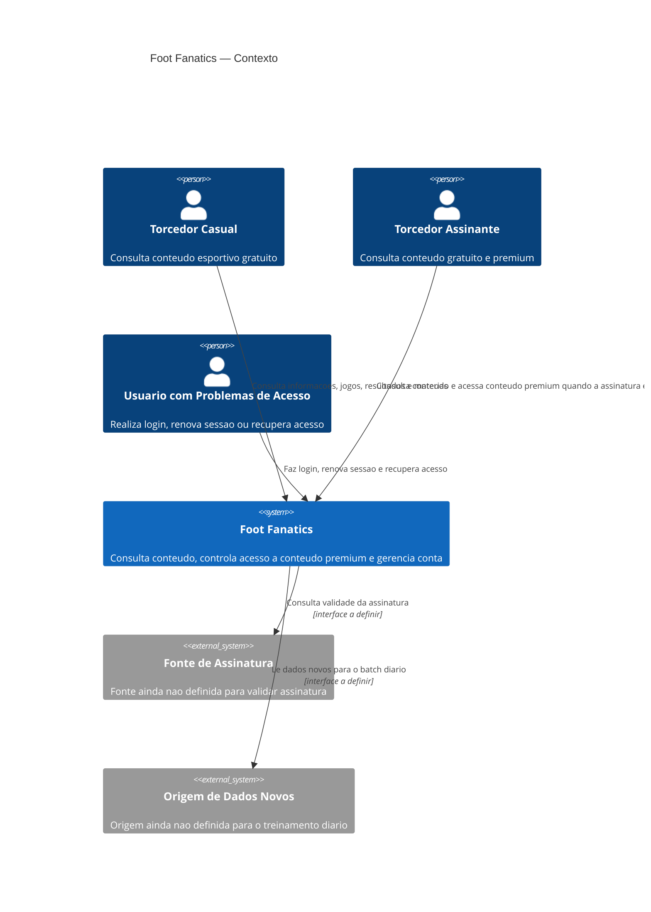
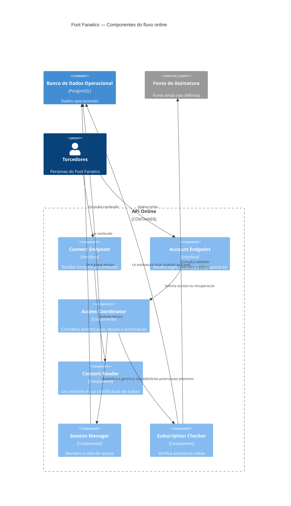
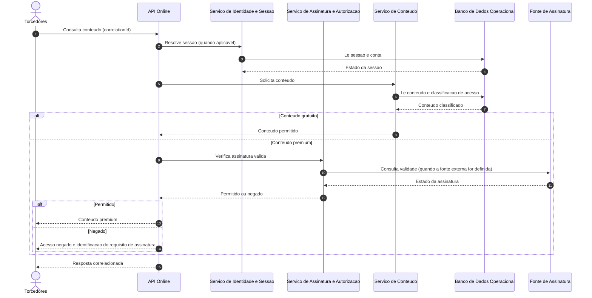
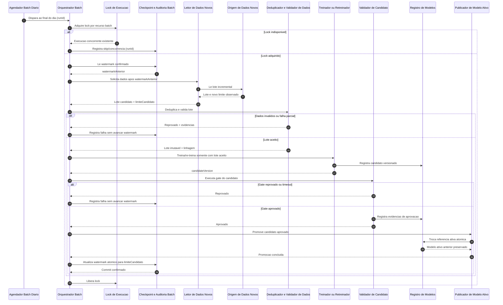

# Foot Fanatics — Base factual da arquitetura

## 1. Contexto e objetivo

O Foot Fanatics e um produto para consulta de informacoes esportivas, jogos,
resultados e materias sobre clubes de interesse. O contexto confirmado e o de
acesso ocasional por torcedores casuais e uso frequente por torcedores
assinantes. Tambem existe a necessidade de acesso seguro a conta, renovacao de
sessao e recuperacao de acesso.

Este documento organiza os fatos disponiveis para orientar a arquitetura. Ele
nao define componentes, fluxos, volumes, tecnologias adicionais, SLAs,
integracoes ou metricas que nao estejam nos artefatos consultados.

## 2. Stakeholders e personas

As personas abaixo foram preservadas de `docs/prd.md`.

### Persona 1 — Torcedor Casual

- **Objetivo:** acompanhar informacoes, jogos, resultados e materias sobre seus
	clubes de interesse.
- **Contexto:** acessa o Foot Fanatics ocasionalmente para consultar conteudo
	esportivo disponivel gratuitamente.
- **Frustracao:** encontrar barreiras de acesso em conteudos que deveriam estar
	disponiveis gratuitamente ou ter dificuldade para identificar quais conteudos
	exigem assinatura.

### Persona 2 — Torcedor Assinante

- **Objetivo:** acessar conteudos esportivos exclusivos e acompanhar clubes,
	jogos, resultados e materias disponiveis para assinantes.
- **Contexto:** possui uma assinatura premium e utiliza o Foot Fanatics com
	frequencia, esperando ter acesso aos conteudos exclusivos enquanto sua
	assinatura estiver valida.
- **Frustracao:** ter uma assinatura ativa e, mesmo assim, nao conseguir
	acessar conteudos premium por problemas de autenticacao, sessao ou
	reconhecimento da assinatura.

### Persona 3 — Usuario com Problemas de Acesso

- **Objetivo:** acessar sua conta de forma segura e recuperar o acesso quando
	tiver problemas com suas credenciais ou sessao.
- **Contexto:** ja possui uma conta no Foot Fanatics e precisa realizar login,
	renovar sua sessao ou recuperar o acesso a conta.
- **Frustracao:** nao conseguir entrar na conta, ter sua sessao encerrada
	inesperadamente ou encontrar dificuldades para recuperar o acesso.

## 3. Fontes de verdade consultadas

Foram consultados integralmente os seguintes artefatos do repositorio:

- `docs/prd.md`: personas do produto. Nao contem IDs de requisitos, regras de
	negocio, restricoes ou decisoes.
- `docs/plano-de-teste.md`: estrategia, niveis, criterios, metas de cobertura e
	ambiente de teste ainda marcados como `TODO`.
- `docs/arquitetura.md`: stack previamente declarada; demais secoes estavam
	como `TODO` antes desta atualizacao.
- `README.md`: apenas o nome do repositorio, sem requisitos do produto.
- `AGENTS.md`: regra de processo que orienta a nao inventar requisitos; nao e
	especificacao funcional do Foot Fanatics.

Os documentos de framework em `.aiox-core/` e `.claude/` foram tratados como
regras de trabalho do repositorio, nao como fonte de requisitos do produto.

## 4. Requisitos arquiteturalmente significativos

Nao ha IDs `RF-*`, `RNF-*` ou outros identificadores de requisitos nos
artefatos do produto. Os itens abaixo sao necessidades explicitas ou
restricoes fornecidas, com sua origem rastreavel.

| ID local | Requisito/necessidade | Impacto arquitetural | Origem | Status |
| --- | --- | --- | --- | --- |
| AS-01 | Disponibilizar informacoes, jogos, resultados e materias para consulta. | O sistema precisa representar e servir esses tipos de conteudo. O mecanismo de armazenamento e consulta nao foi definido. | `docs/prd.md`, Persona 1 — Objetivo | Fato confirmado |
| AS-02 | Diferenciar conteudo gratuito de conteudo que exige assinatura. | O acesso precisa considerar a classificacao de acesso do conteudo e torna-la identificavel ao usuario. O modelo e o fluxo nao foram definidos. | `docs/prd.md`, Persona 1 — Frustracao | Fato confirmado |
| AS-03 | Permitir acesso a conteudo exclusivo para assinantes com assinatura valida. | A autorizacao precisa considerar a validade da assinatura. Integracao, estados e fonte da assinatura nao foram definidos. | `docs/prd.md`, Persona 2 — Objetivo e Contexto | Fato confirmado |
| AS-04 | Suportar login, renovacao de sessao e recuperacao de acesso. | Exige capacidades de identidade, sessao e recuperacao; protocolos, tokens e canais nao foram definidos. | `docs/prd.md`, Persona 3 — Contexto e Objetivo | Fato confirmado |
| AS-05 | Proteger o acesso a conta. | Seguranca e controle de acesso sao preocupacoes arquiteturais explicitas; requisitos verificaveis nao foram especificados. | `docs/prd.md`, Persona 3 — Objetivo | Fato confirmado; detalhamento pendente |
| AS-06 | Executar diariamente, ao final do dia, treinamento ou retreinamento usando somente dados novos. | Exige um agendamento diario e uma estrategia de selecao de dados novos. O horario, fuso, mecanismo de treino, armazenamento do modelo, criterio de retreino e tratamento de falha nao foram definidos. | Restricao fornecida pelo professor | Restricao obrigatoria externa |
| AS-07 | Usar Java 21, Spring Boot 3.x, PostgreSQL e Maven. | Limita as escolhas de implementacao e persistencia da solucao. | `docs/arquitetura.md` (stack preexistente) | Fato confirmado como decisao existente; justificativa ausente |

## 5. Atributos de qualidade

Nao foram definidos RNFs, metas ou metricas nos artefatos. Portanto, os itens
abaixo nao sao compromissos de qualidade; sao preocupacoes derivadas de fatos
explícitos e devem ser transformadas em requisitos verificaveis antes da
implementacao.

| Atributo | Evidencia/origem | O que falta definir |
| --- | --- | --- |
| Seguranca | A Persona 3 exige acesso seguro; a Persona 2 relata falhas de autenticacao e sessao. Origem: `docs/prd.md`, Personas 2 e 3. | Requisitos de autenticacao, autorizacao, recuperacao, protecao de credenciais e metas de seguranca. |
| Disponibilidade de acesso autorizado | A Persona 2 espera acessar conteudo premium enquanto a assinatura estiver valida. Origem: `docs/prd.md`, Persona 2 — Contexto. | Janela de disponibilidade, comportamento em falhas e SLA. |
| Confiabilidade de sessao e assinatura | As frustracoes citam encerramento inesperado de sessao e nao reconhecimento da assinatura. Origem: `docs/prd.md`, Personas 2 e 3 — Frustracoes. | Regras de expiracao/renovacao, consistencia da validade e metricas de erro. |
| Atualidade do treinamento | A restricao externa determina uso somente de dados novos em execucao diaria. Origem: restricao fornecida pelo professor. | Definicao operacional de dado novo, janela temporal e criterio de sucesso. |

## 6. Drivers priorizados

Prioridade qualitativa baseada na evidencia disponivel, nao em uma metrica
formal:

1. **Acesso correto ao conteudo:** diferencia gratuidade de assinatura e
	 entrega conteudo premium a assinantes validos. Origem: `docs/prd.md`,
	 Personas 1 e 2.
2. **Acesso a conta:** login, sessao e recuperacao precisam atender a persona
	 com problemas de acesso. Origem: `docs/prd.md`, Persona 3.
3. **Seguranca da conta:** o acesso deve ser seguro. Origem: `docs/prd.md`,
	 Persona 3.
4. **Rotina diaria de treinamento com dados novos:** restricao obrigatoria da
	 atividade. Origem: restricao fornecida pelo professor.
5. **Aderencia a stack declarada:** Java 21, Spring Boot 3.x, PostgreSQL e
	 Maven. Origem: `docs/arquitetura.md` preexistente.

## 7. Glossario

- **Conteudo gratuito:** conteudo esportivo que, segundo a Persona 1, deve
	estar disponivel sem assinatura. A regra detalhada de classificacao nao foi
	definida.
- **Conteudo premium/exclusivo:** conteudo disponivel para assinantes segundo a
	Persona 2.
- **Assinatura valida:** assinatura que, segundo a Persona 2, permite acesso ao
	conteudo exclusivo. Estados e fonte de verdade nao foram definidos.
- **Sessao:** estado de acesso autenticado do usuario; duracao, renovacao e
	expiracao nao foram definidas.
- **Dados novos:** dados elegiveis para o treinamento diario conforme a
	restricao fornecida pelo professor. A definicao operacional esta em aberto.
- **Treinamento/retreinamento:** processamento diario mencionado na restricao
	externa. Objetivo, algoritmo e artefatos produzidos nao foram definidos.

## 8. Fatos, lacunas, conflitos, suposicoes e perguntas abertas

### Fatos confirmados

- Existem tres personas: Torcedor Casual, Torcedor Assinante e Usuario com
	Problemas de Acesso, descritas em `docs/prd.md`.
- O produto envolve informacoes, jogos, resultados, materias, conteudo gratuito
	e conteudo exclusivo para assinantes.
- Login, renovacao de sessao e recuperacao de acesso fazem parte do contexto
	da Persona 3.
- A stack declarada e Java 21, Spring Boot 3.x, PostgreSQL e Maven.
- A atividade exige um cron job diario no final do dia para treinar ou
	retreinar usando somente dados novos.

### Lacunas

- Nao ha requisitos funcionais ou nao funcionais identificados por IDs.
- Nao ha regras de negocio formais para assinatura, classificacao de conteudo,
	expiracao ou recuperacao de acesso.
- Nao ha modelo de dados, camadas, APIs, integracoes ou componentes definidos.
- Nao ha volumes, carga, SLA, metas de cobertura, ambiente de teste ou
	estrategia de testes definidos; `docs/plano-de-teste.md` esta em `TODO`.
- Nao ha detalhes do treinamento, dos dados, do modelo, do armazenamento ou do
	monitoramento do job diario.
- Nao ha ADRs ou justificativas para a stack declarada.

### Conflitos

- Nenhum conflito foi encontrado entre `docs/prd.md`, `docs/arquitetura.md` e
	`docs/plano-de-teste.md`.
- A exigencia do cron job diario e o uso exclusivo de dados novos nao aparecem
	nos artefatos consultados. Tambem nao contradizem um requisito existente. Sua
	origem deve ser registrada como **restricao fornecida pelo professor**, e nao
	como requisito previamente levantado.

### Suposicoes

- Nenhuma suposicao de arquitetura, tecnologia, fluxo, volume ou metricas foi
	promovida a fato neste documento.
- A prioridade dos drivers na secao 6 e uma ordenacao analitica provisoria,
	baseada nas personas, nao uma prioridade de negocio formalmente aprovada.

### Perguntas abertas

- Quais sao os requisitos funcionais e nao funcionais formais e seus IDs?
- Quais regras determinam conteudo gratuito, premium e assinatura valida?
- Qual e a fonte de verdade da assinatura e existe alguma integracao externa?
- Quais sao os fluxos e requisitos de login, renovacao de sessao e recuperacao?
- Qual e o horario exato, fuso e comportamento de retry do cron job?
- Como identificar e impedir a reutilizacao de dados ja usados no treinamento?
- O job sempre treina ou decide entre treinar e retreinar por algum criterio?
- Onde ficam armazenados dados, modelos e resultados do processamento?
- Quais volumes, picos, metas de desempenho, disponibilidade e seguranca devem
	ser atendidos?
- Quais decisoes justificam a stack Java 21, Spring Boot 3.x, PostgreSQL e
	Maven?
- Quais testes, ambientes e metas de cobertura serao definidos no plano de
	teste?

## 9. Riscos arquiteturais iniciais

| Risco | Evidencia | Consequencia potencial | Mitigacao a definir |
| --- | --- | --- | --- |
| Autorizacao inconsistente | Acesso premium depende de assinatura valida, mas nao ha regra nem fonte de assinatura. | Conceder acesso indevido ou bloquear assinantes validos. | Definir fonte de verdade, estados e verificacoes de autorizacao. |
| Sessoes pouco confiaveis | Personas citam encerramento inesperado, falhas de autenticacao e recuperacao. | Perda de acesso e frustracao recorrente. | Especificar ciclo de vida da sessao e cenarios de recuperacao. |
| Seguranca insuficientemente especificada | Acesso seguro e objetivo explicito, sem RNF ou controles definidos. | Exposicao de contas ou dados. | Elaborar requisitos de seguranca verificaveis antes da implementacao. |
| Job diario nao reproduzivel | A restricao exige somente dados novos, mas nao define identificacao, janela ou idempotencia. | Dados repetidos, dados omitidos ou modelos inconsistentes. | Definir contrato de novidade, registro de processamento e falhas. |
| Stack sem decisao documentada | A stack existe no rascunho, sem ADR ou justificativa. | Decisoes futuras desalinhadas ou dificuldade de manutencao. | Registrar justificativas e limites quando os requisitos forem detalhados. |
| Qualidade nao mensuravel | Plano de teste e RNFs estao sem metas. | Impossibilidade de avaliar prontidao e regressao. | Completar o plano de teste com criterios rastreaveis aos requisitos. |

## 10. Decisoes (ADR)

Nenhum ADR foi encontrado nos artefatos consultados. A stack registrada na
secao 1 e uma decisao preexistente, mas sua motivacao e seus trade-offs sao
lacunas. Nao ha base factual para registrar outras decisoes arquiteturais
neste momento.

## 11. Proposta de limites e responsabilidades

Esta secao e uma concepcao arquitetural orientada pelos drivers, nao uma
descricao de componentes ja existentes. Os nomes usados aqui sao os mesmos
utilizados nos diagramas das secoes seguintes.

### Fluxo online

- **Cliente do Foot Fanatics:** inicia consultas de conteudo, login, renovacao
	de sessao e recuperacao de acesso. Pode representar Torcedor Casual,
	Torcedor Assinante ou Usuario com Problemas de Acesso.
- **API Online:** expoe as interfaces de conteudo e conta, correlaciona cada
	requisicao e coordena autenticacao, sessao, assinatura e autorizacao.
- **Servico de Conteudo:** consulta informacoes, jogos, resultados e materias;
	informa se o conteudo e gratuito ou premium.
- **Servico de Identidade e Sessao:** executa login, renovacao e recuperacao de
	acesso, sem definir neste documento protocolo, token ou canal.
- **Servico de Assinatura e Autorizacao:** verifica a validade da assinatura e
	decide o acesso ao conteudo premium. A fonte de assinatura ainda e uma
	pergunta aberta.
- **Banco de Dados Operacional:** persiste dados necessarios ao online,
	incluindo conteudo, conta, sessao e assinatura somente quando a modelagem e
	a fonte desses dados forem definidas. A tecnologia PostgreSQL e a stack
	declarada, mas o esquema ainda nao foi definido.

O fluxo online nao depende da execucao do batch para autenticar, validar
assinatura ou servir conteudo. O modelo treinado, caso seja confirmado como
necessario para alguma funcionalidade futura, deve ser lido pelo online por
uma interface de modelo ativo e nao por arquivos temporarios do batch.

### Pipeline batch diario

- **Agendador Batch Diario:** dispara uma execucao ao final do dia. Horario e
	fuso sao perguntas abertas.
- **Orquestrador Batch:** cria um identificador de execucao, adquire lock,
	coordena as etapas e registra o estado.
- **Leitor de Dados Novos:** seleciona dados posteriores ao watermark confirmado
	e entrega um lote imutavel para a execucao.
- **Deduplicador e Validador de Dados:** aplica a chave de deduplicacao definida
	pelo dominio, verifica esquema e qualidade e registra a linhagem. Chaves,
	regras e limiares ainda nao foram definidos.
- **Treinador ou Retreinador:** produz um candidato usando exclusivamente o
	lote aceito da execucao. O algoritmo e o criterio para escolher entre
	treinamento e retreinamento permanecem em aberto.
- **Validador de Candidato:** executa o gate de qualidade antes de qualquer
	promocao. Nao ha promocao sem sucesso neste gate.
- **Registro de Modelos:** versiona candidatos, modelos promovidos, metadados,
	dados de treino e resultados de validacao. A tecnologia nao foi definida.
- **Publicador de Modelo Ativo:** promove atomicamente somente um candidato
	aprovado e preserva a referencia anterior para rollback. O modelo ativo fica
	isolado do workspace temporario do treinamento.
- **Checkpoint e Auditoria Batch:** persiste watermark, estado da execucao,
	eventos de processamento, linhagem e auditoria. A atualizacao do checkpoint
	ocorre somente depois do sucesso de todas as etapas obrigatorias.

## 12. Interfaces, dependencias e dados

| Interface | Consumidor | Provedor | Contrato minimo | Dependencias e lacunas |
| --- | --- | --- | --- | --- |
| Consulta de conteudo | Cliente do Foot Fanatics | API Online | Consulta de informacoes, jogos, resultados e materias; indicacao de acesso gratuito ou premium. | Formato, paginacao, erros e desempenho sem requisito correspondente. |
| Autenticacao e sessao | Cliente do Foot Fanatics | API Online / Servico de Identidade e Sessao | Login, renovacao e recuperacao de acesso. | Protocolo, token, validade, canal de recuperacao e limites sem requisito correspondente. |
| Autorizacao premium | API Online | Servico de Assinatura e Autorizacao | Decisao baseada em assinatura valida para conteudo premium. | Fonte da assinatura, estados e integração sem requisito correspondente. |
| Persistencia operacional | Servicos online | Banco de Dados Operacional | Dados necessarios ao conteudo, conta, sessao e assinatura. | Esquema, consistencia, retencao e volume sem requisito correspondente. |
| Leitura incremental | Orquestrador Batch | Leitor de Dados Novos | Lote identificado por watermark anterior e novo limite confirmado. | Definicao de dado novo, origem, janela e formato sem requisito correspondente. |
| Treino | Orquestrador Batch | Treinador ou Retreinador | Candidato produzido apenas com lote aceito da execucao. | Algoritmo, features, alvo, recursos e tempo limite sem requisito correspondente. |
| Gate de modelo | Orquestrador Batch | Validador de Candidato | Resultado aprovado/reprovado com evidencias versionadas. | Metricas, limiares e conjunto de validacao sem requisito correspondente. |
| Promocao e rollback | Orquestrador Batch | Registro de Modelos / Publicador de Modelo Ativo | Referencia versionada e troca atomica do modelo ativo. | Registry, mecanismo de atomicidade e politica de rollback sem requisito correspondente. |

Dados compartilhados devem ter identificador de origem, instante observado,
versao de esquema e referencia de linhagem quando esses campos forem definidos
pelo dominio. O batch deve ler uma visao consistente do lote; o online deve
continuar lendo o Banco de Dados Operacional enquanto o batch processa. Nao ha
base para definir sincronizacao, particionamento ou formato de dados.

## 13. Diagramas arquiteturais

Os diagramas abaixo usam os mesmos nomes e relacoes descritos nas secoes 11 e
12. C4-PlantUML e usado no formato Mermaid por meio dos blocos C4.

### 13.1 Contexto C4



### 13.2 Contêineres C4

```mermaid
C4Container
title Foot Fanatics — Contêineres

Person(user, "Torcedores", "Torcedor Casual, Torcedor Assinante ou Usuario com Problemas de Acesso")
System_Ext(subscription_source, "Fonte de Assinatura", "Fonte ainda nao definida")
System_Ext(new_data_source, "Origem de Dados Novos", "Origem ainda nao definida")
System_Boundary(foot_fanatics, "Foot Fanatics") {
	Container(online_api, "API Online", "Java 21 / Spring Boot 3.x", "Interfaces de conteudo e conta")
	Container(content_service, "Servico de Conteudo", "Componente da API Online", "Consulta e classificacao de conteudo")
	Container(identity_service, "Servico de Identidade e Sessao", "Componente da API Online", "Login, renovacao e recuperacao")
	Container(authz_service, "Servico de Assinatura e Autorizacao", "Componente da API Online", "Valida assinatura e autoriza premium")
	Container(operational_db, "Banco de Dados Operacional", "PostgreSQL", "Dados operacionais do online")
	Container(batch_scheduler, "Agendador Batch Diario", "Implementacao nao definida", "Disparo diario ao final do dia")
	Container(batch_orchestrator, "Orquestrador Batch", "Implementacao nao definida", "Coordena leitura, treino, gate, promocao e checkpoint")
	Container(new_data_reader, "Leitor de Dados Novos", "Componente do batch", "Leitura incremental por watermark")
	Container(data_quality, "Deduplicador e Validador de Dados", "Componente do batch", "Deduplicacao, esquema, qualidade e linhagem")
	Container(trainer, "Treinador ou Retreinador", "Componente do batch", "Produz candidato somente com dados novos")
	Container(candidate_validator, "Validador de Candidato", "Componente do batch", "Gate antes da promocao")
	Container(model_registry, "Registro de Modelos", "Persistencia nao definida", "Versionamento, promocao e rollback")
	Container(model_publisher, "Publicador de Modelo Ativo", "Componente do batch", "Publicacao atomica de modelo aprovado")
	Container(checkpoint_audit, "Checkpoint e Auditoria Batch", "Persistencia nao definida", "Watermark, estados, linhagem e auditoria")
}

Rel(user, online_api, "Usa", "HTTPS ou protocolo a definir")
Rel(online_api, content_service, "Encaminha consultas")
Rel(online_api, identity_service, "Encaminha operacoes de conta")
Rel(online_api, authz_service, "Solicita autorizacao premium")
Rel(content_service, operational_db, "Le conteudo")
Rel(identity_service, operational_db, "Le e grava conta e sessao")
Rel(authz_service, operational_db, "Le estado local de assinatura quando aplicavel")
Rel(authz_service, subscription_source, "Consulta validade", "interface a definir")
Rel(batch_scheduler, batch_orchestrator, "Dispara execucao diaria")
Rel(batch_orchestrator, new_data_reader, "Solicita lote por watermark")
Rel(new_data_reader, new_data_source, "Le dados novos", "interface a definir")
Rel(batch_orchestrator, data_quality, "Submete lote para validacao")
Rel(batch_orchestrator, trainer, "Solicita treino ou retreino")
Rel(batch_orchestrator, candidate_validator, "Solicita gate")
Rel(batch_orchestrator, model_publisher, "Solicita promocao somente se aprovado")
Rel(trainer, model_registry, "Registra candidato e metadados")
Rel(candidate_validator, model_registry, "Registra evidencias de validacao")
Rel(model_publisher, model_registry, "Publica versao aprovada e preserva anterior")
Rel(batch_orchestrator, checkpoint_audit, "Le e atualiza checkpoint apos sucesso")
Rel(batch_orchestrator, operational_db, "Le dados necessarios quando aplicavel")
```



### 13.3 Componentes do fluxo online



### 13.4 Sequência do fluxo online



O protocolo de sessao e a fonte de assinatura permanecem indefinidos; as
mensagens acima representam responsabilidades, nao contratos implementados.

### 13.5 Sequência da execução batch



## 14. Garantias do batch e tratamento de falhas

As regras desta secao sao invariantes de projeto derivadas diretamente da
restricao AS-06 e do driver de atualidade do treinamento. Os detalhes de
implementacao continuam em aberto.

### Watermark, checkpoint e dados novos

1. A execucao le `watermarkAnterior` do Checkpoint e Auditoria Batch.
2. O Leitor de Dados Novos seleciona somente dados posteriores a esse
	 watermark e produz um `limiteCandidato`.
3. O lote aceito e imutavel durante a execucao e carrega sua linhagem.
4. O checkpoint so pode ser atualizado atomicamente para `limiteCandidato`
	 depois de treino, validacao aprovada, promocao concluida e auditoria
	 registrada.
5. Falhas de leitura, qualidade, treino, validacao ou promocao mantem o
	 watermark anterior. Reprocessar a mesma janela deve ser suportado sem
	 contaminar o modelo ativo.

O tipo do watermark, a semantica de inclusao/exclusao dos limites, a fonte de
tempo e a definicao de dado novo sao perguntas abertas. A atualizacao atomica
deve ser implementada como uma unica transacao ou mecanismo equivalente, mas a
tecnologia desse mecanismo nao foi definida.

### Idempotência e deduplicação

- Cada execucao possui `runId`; cada lote possui uma identidade derivada da
	origem, janela e versao de esquema quando esses campos forem definidos.
- O Orquestrador Batch deve reconhecer uma execucao repetida e nao promover
	duas vezes o mesmo candidato.
- O Deduplicador e Validador de Dados precisa de uma chave de deduplicacao
	definida pelo dominio. Sem essa chave, a deduplicacao nao pode ser
	considerada resolvida.
- O Registro de Modelos deve rejeitar ou tratar como no-op uma promocao de
	`candidateVersion` ja promovida.

As chaves, armazenamento do estado idempotente e politica para duplicatas sao
lacunas; as regras acima sao uma proposta de contrato a validar.

### Lock, concorrência e isolamento

- O Orquestrador Batch adquire um lock antes de ler o checkpoint.
- Uma nova execucao concorrente deve ser encerrada ou marcada como skip sem
	modificar checkpoint, modelo ativo ou dados do online.
- O treinamento usa workspace e artefatos candidatos separados do modelo ativo.
- O Publicador de Modelo Ativo troca somente uma referencia aprovada; o
	processo de treino nunca substitui o artefato ativo diretamente.

Lock distribuido versus lock transacional no Banco de Dados Operacional sao
alternativas. Lock distribuido pode desacoplar a coordenação, mas exige um
servico adicional sem requisito correspondente. Lock transacional reduz
dependencias, mas acopla a concorrencia ao banco. Escolha adiada até definir
topologia, número de executores e semantica de falha.

### Retry, timeout, recuperação e falha parcial

- Retry deve ser limitado e associado a `runId` e etapa; o numero de tentativas
	e o backoff sao perguntas abertas.
- Cada etapa deve ter timeout para evitar que a rotina permaneça indefinida;
	os limites nao foram especificados.
- Leitura, deduplicacao, treino, validacao e promocao devem registrar estado
	antes e depois da etapa.
- Falha parcial nao avanca checkpoint e nao altera o modelo ativo.
- Recuperacao deve retomar ou reiniciar a partir do watermark anterior, usando
	artefatos de execucao versionados quando isso for suportado; o ponto exato
	de retomada e uma pergunta aberta.

Retry no mesmo processo versus retry por nova execucao agendada sao
alternativas. Retry local reduz latencia de recuperacao transitória; nova
execucao simplifica o controle de estado, mas pode esperar a proxima janela.
Sem SLA ou volume, a escolha fica adiada.

### Dados tardios

Dados que chegam depois do watermark podem ser omitidos se o watermark for
baseado somente no horario de observacao. Alternativas:

1. **Watermark por tempo de evento com janela de tolerancia:** captura eventos
	 tardios, ao custo de reprocessar uma janela e exigir deduplicacao forte.
2. **Watermark por sequencia da fonte:** evita dependencia de relogios, mas
	 depende de a origem fornecer uma sequencia monotônica.

Nao ha requisito correspondente para escolher uma alternativa. A politica de
dados tardios, a janela e a garantia de ordenacao devem ser definidas antes da
implementacao.

### Qualidade, esquema, linhagem e reprodutibilidade

- O lote deve ser validado contra uma versao de esquema conhecida antes do
	treino; o esquema nao foi fornecido.
- O resultado deve registrar origem, janela, watermark, versao de esquema,
	transformacoes, `runId`, `candidateVersion` e resultado do gate, quando esses
	conceitos forem confirmados.
- Falha de esquema ou qualidade impede treino e promocao, sem avancar
	checkpoint.
- Reprodutibilidade exige preservar a identificacao do lote, transformacoes,
	configuracao do treino, codigo e dependencias; nenhum mecanismo de
	empacotamento ou armazenamento foi definido.

Validacao em dados historicos fixos versus validacao temporal usando dados
posteriores ao treino sao alternativas para o gate. A primeira facilita
comparacao; a segunda pode representar melhor dados futuros. Metricas, alvo e
criterio de escolha nao existem nos artefatos, portanto a estrategia e adiada.

### Validação, promoção, versionamento e rollback

- Todo candidato recebe uma versao no Registro de Modelos antes do gate.
- O Validador de Candidato deve produzir aprovado/reprovado com evidencias.
- O Publicador de Modelo Ativo so pode promover candidato aprovado e troca a
	referencia de forma atomica.
- O modelo ativo anterior permanece versionado e isolado para rollback.
- Reprovacao, timeout ou falha de promocao preservam o modelo ativo anterior e
	o watermark anterior.

Promocao por substituicao atomica de referencia versus roteamento por alias
versionado sao alternativas. A referencia atomica e conceitualmente simples;
alias permite historico de apontamentos, mas requer capacidades do Registro de
Modelos. Sem tecnologia ou requisito de rollout, a escolha e uma hipótese
validavel, nao uma decisão fechada.

## 15. Observabilidade e auditoria

### Logs correlacionados

Todos os componentes online devem propagar `correlationId`; todos os
componentes batch devem propagar `runId` e, quando aplicavel, `candidateVersion`
e `watermark`. Logs devem registrar inicio, fim, resultado, erro e duracao de
cada etapa sem registrar credenciais, tokens ou dados pessoais desnecessarios.
Formato, destino, retencao e nivel de log nao foram definidos.

### Métricas e alertas

As seguintes familias de metricas sao necessarias para observar os riscos, mas
nao sao metas quantitativas:

- sucesso, falha, duracao, timeout e retry por etapa do batch;
- idade do watermark, quantidade de dados lidos, aceitos, duplicados e
	rejeitados;
- estado do lock e execucoes concorrentes;
- resultado de validacao, promocao e rollback;
- erros de login, renovacao, recuperacao, autorizacao premium e consulta de
	conteudo no online;
- disponibilidade do modelo ativo, quando o online o consumir.

Alertas devem ser definidos para falha do job, ausencia de atualizacao do
watermark, falha no gate, promocao inesperada, aumento de erros de acesso e
perda de disponibilidade. Limiares, canais e responsáveis sao perguntas
abertas. Nenhuma métrica ausente foi inventada.

### Auditoria

O Checkpoint e Auditoria Batch deve manter o historico de execucoes,
watermarks, decisões de qualidade, candidatos, gates, promocoes, rollbacks e
falhas. A auditoria online deve permitir investigar acesso premium, login,
renovacao e recuperacao sem expor segredo. Periodo de retencao e requisitos
regulatorios especificos nao foram informados.

## 16. Segurança e LGPD

Esta secao traduz AS-05 e as personas em controles a especificar; nao afirma
que os controles ja existem.

- **Minimizacao:** coletar e persistir somente dados necessarios para conta,
	sessao, assinatura, conteudo e treinamento. Os campos necessarios nao foram
	definidos.
- **Acesso:** separar privilegios do online, do Orquestrador Batch, do
	Treinador ou Retreinador, do Publicador de Modelo Ativo e da auditoria. Perfis
	e matriz de permissao sao perguntas abertas.
- **Criptografia:** proteger dados em transito e em repouso; algoritmos,
	gerenciamento de chaves e escopo nao possuem requisito correspondente.
- **Retencao:** definir prazos diferentes para conta, sessao, dados brutos,
	lotes, modelos, logs e auditoria. Nenhum prazo foi fornecido.
- **Descarte:** apagar ou anonimizar dados pessoais e artefatos quando a
	finalidade ou prazo terminar, respeitando dependencias de auditoria. O
	processo nao foi definido.
- **Dados de ML:** verificar se dados pessoais entram no lote; preferir
	minimizacao e controle de acesso. Nao ha base para afirmar que o treinamento
	usa dados pessoais.
- **Segredos:** nao registrar credenciais, tokens ou dados pessoais
	desnecessarios em logs, candidatos ou metadados.

Alternativas para dados de treinamento sao manter dados identificaveis com
acesso restrito ou aplicar anonimização/pseudonimização antes do treinamento.
Anonimização reduz exposição, mas pode remover sinal útil; acesso restrito
preserva mais contexto, mas aumenta risco. A escolha depende dos dados reais e
da base legal, ainda ausentes.

## 17. Custos e crescimento

Nao ha volumes ou orçamento nos artefatos. A análise abaixo identifica centros
de custo sem estimar valores:

- **Janela:** executar o batch ao final do dia; horário, duração máxima e
	impacto da janela ainda nao foram definidos.
- **Computação:** custo do Treinador ou Retreinador e da validação depende do
	volume de dados, algoritmo e frequência real de reprocessamento, todos
	ausentes.
- **Armazenamento:** Banco de Dados Operacional, lotes imutáveis, checkpoints,
	logs, auditoria e versões de modelos crescem com o uso; retenção e política
	de descarte nao foram fornecidas.
- **Online:** o isolamento do batch evita que a computação de treinamento
	concorra diretamente com o fluxo online, mas a capacidade necessária nao foi
	quantificada.

Batch compartilhando computação com o online versus computação isolada sao
alternativas. Compartilhar tende a reduzir infraestrutura, mas aumenta risco
de interferência no acesso; isolar protege o online, mas pode elevar custo.
Sem volumes, SLA ou orçamento, a escolha deve permanecer em aberto.

## 18. Suposições, alternativas e perguntas arquiteturais adicionadas

### Suposições explicitamente condicionais

- O online e o batch podem compartilhar o Banco de Dados Operacional apenas
	para dados que tenham contrato definido; isso e uma hipótese de desenho, nao
	fato do produto.
- O treinamento produz um modelo que pode ser versionado e consumido por uma
	referencia ativa; isso e uma hipótese necessária para discutir promoção, nao
	um requisito funcional confirmado.
- `runId`, `candidateVersion`, `watermarkAnterior` e `limiteCandidato` sao
	identificadores de projeto propostos para tornar o fluxo auditável; os
	formatos e a existência definitiva ainda precisam de validação.

### Perguntas prioritárias

1. Qual funcionalidade online usa o modelo treinado e qual contrato ela exige?
2. Qual e a origem dos dados novos e qual campo define sua novidade?
3. Qual e o horario/fuso do final do dia e qual a duração máxima aceitável?
4. Quais são as métricas e limiares do gate de candidato?
5. Qual e a política de retenção, base legal e tratamento de dados pessoais?
6. Qual e a fonte da assinatura e quais estados representam assinatura valida?
7. Quais volumes, concorrência, disponibilidade, orçamento e canais de alerta
	 devem orientar as escolhas ainda adiadas?

## 19. Rastreabilidade das escolhas

| Escolha ou invariante | Base | Natureza |
| --- | --- | --- |
| Separar API Online de Pipeline Batch Diario | AS-01 a AS-06; risco de interferencia entre treino e acesso | Proposta arquitetural |
| Checkpoint somente apos sucesso completo | AS-06 e criterio da atividade: batch nao pode avancar checkpoint antes do sucesso | Restricao/invariante obrigatoria |
| Modelo ativo isolado e rollback preservado | AS-06; criterio da atividade: batch nao pode derrubar o online nem promover sem gate | Invariante obrigatoria |
| Gate antes da promocao | AS-06 e criterio da atividade | Invariante obrigatoria |
| Java 21, Spring Boot 3.x, PostgreSQL e Maven | AS-07 | Restricao/decisao preexistente |
| Lock, watermark, idempotencia, deduplicacao e auditoria | Necessarios para satisfazer o processamento incremental sem contaminar online; sem requisito detalhado | Proposta a validar |
| LGPD, observabilidade e custo | AS-05, AS-06 e riscos identificados; sem RNFs ou métricas | Preocupações arquiteturais, nao metas |

## 20. Avaliação ATAM independente

### 20.1 Escopo e base da avaliação

Esta seção registra uma avaliação independente baseada no método ATAM (Architecture
Tradeoff Analysis Method). Foram considerados integralmente os seguintes artefatos:

- `docs/prd.md`, com as personas do produto;
- `docs/arquitetura.md`, incluindo fatos, requisitos arquiteturalmente
	significativos, drivers, propostas, invariantes, riscos e perguntas abertas;
- `docs/plano-de-teste.md`, cuja estratégia ainda está marcada como `TODO`;
- as personas dos agentes em `.aiox-core/development/agents/` e seus arquivos
	`MEMORY.md`, considerados como regras de trabalho e governança, não como
	requisitos funcionais do Foot Fanatics.

A avaliação não substitui requisitos de produto, não aprova decisões ainda em
aberto e não representa evidência de que componentes ou controles já estejam
implementados.

### 20.2 Veredito

**Resultado: CONCERNS fortes; arquitetura não aprovada para implementação
produtiva neste estado.**

A arquitetura fornece uma boa base de descoberta: explicita suas lacunas,
separa o fluxo online do batch e registra invariantes relevantes para dados
incrementais, promoção de modelos e recuperação. Entretanto, ainda não há
requisitos mensuráveis, contratos fechados, decisões arquiteturais justificadas
ou estratégia de testes suficiente para demonstrar segurança, confiabilidade e
correção.

O parecer permite evolução da documentação e prototipação controlada, mas o
início de implementação produtiva deve aguardar o tratamento dos riscos
críticos e altos desta seção.

### 20.3 Pontos fortes observados

- A separação entre API Online e Pipeline Batch reduz o risco de interferência
	entre treinamento e acesso dos usuários.
- O uso combinado de `watermark`, `runId`, checkpoint, lock, idempotência e
	linhagem endereça corretamente os riscos de reprocessamento.
- A promoção condicionada a um gate e a preservação do modelo anterior
	favorecem rollback controlado.
- A arquitetura distingue fatos, restrições, propostas, suposições e perguntas
	abertas, evitando apresentar hipóteses como decisões confirmadas.
- As três personas do produto estão coerentes com os drivers de conteúdo,
	assinatura e recuperação de acesso.
- Logs correlacionados, auditoria e preocupações de LGPD foram identificados
	nos pontos em que podem influenciar a solução.

### 20.4 Riscos arquiteturais prioritários

#### R1. Requisitos insuficientes para validar a arquitetura

**Severidade: crítica.**

O PRD contém personas, mas não contém requisitos funcionais, requisitos não
funcionais, regras de negócio ou métricas. Portanto, não é possível provar que
a solução atende ao produto.

Consequências potenciais:

- ausência de critérios objetivos para aprovar ou rejeitar decisões
	arquiteturais;
- impossibilidade de medir disponibilidade, latência, segurança ou sucesso do
	batch;
- risco de implementar componentes que não correspondem a uma necessidade
	confirmada.

Mitigação requerida: definir requisitos identificados, critérios de aceitação,
cenários de qualidade e métricas antes da implementação produtiva.

#### R2. Atomicidade incompleta entre promoção e checkpoint

**Severidade: alta.**

A arquitetura exige que promoção do modelo, auditoria e avanço do watermark
ocorram de forma atômica. Porém, esses elementos podem estar em registros,
serviços ou armazenamentos diferentes.

Se a promoção for concluída e o checkpoint falhar, a próxima execução poderá
reprocessar os dados. Se o checkpoint avançar antes da promoção, dados poderão
ser considerados processados sem que o modelo correspondente esteja ativo.

Mitigação requerida: escolher e documentar uma estratégia entre transação única
no mesmo armazenamento, protocolo de compensação, máquina de estados com
operações idempotentes ou publicação por alias/versionamento com reconciliação.

#### R3. Fonte e semântica da assinatura não definidas

**Severidade: alta.**

A autorização premium depende de uma Fonte de Assinatura ainda indefinida. Não
há regras para estados da assinatura, atraso de sincronização, indisponibilidade
da fonte, revogação, cache ou comportamento degradado.

Consequências potenciais:

- concessão indevida de conteúdo premium;
- bloqueio de assinantes legítimos;
- respostas inconsistentes entre sessões ou requisições.

Mitigação requerida: definir a fonte de verdade, estados válidos, política de
cache, tolerância a falhas e comportamento de autorização em cada estado.

#### R4. Segurança de identidade ainda não é verificável

**Severidade: alta.**

Login, renovação e recuperação são responsabilidades descritas, mas não há
protocolo, política de sessão, proteção contra abuso, mecanismo de recuperação,
MFA, rate limiting, armazenamento de credenciais, expiração ou auditoria
definidos.

A exigência de acesso seguro não possui cenário testável nem critério de
aceitação.

Mitigação requerida: especificar autenticação, autorização, ciclo de vida da
sessão, recuperação, proteção de credenciais, limites de tentativa, gestão de
segredos, auditoria e metas de segurança.

#### R5. O modelo treinado não possui consumidor definido

**Severidade: alta.**

A arquitetura assume modelo ativo, registro, promoção e rollback, mas não
identifica qual funcionalidade online utiliza o modelo.

Isso cria risco de complexidade sem valor de negócio e impede definir métrica
do modelo, SLA de atualização, comportamento em caso de indisponibilidade,
contrato de inferência e critério de rollback.

Mitigação requerida: identificar a funcionalidade consumidora e seu contrato,
ou remover o pipeline de modelo do escopo até existir uma necessidade
confirmada.

#### R6. Dados novos e dados tardios permanecem indefinidos

**Severidade: alta.**

A regra de usar somente dados novos depende de uma definição operacional de
novidade. Ainda não foi decidido se o watermark será baseado em tempo de evento,
tempo de observação ou sequência monotônica da origem.

Sem essa decisão, não há garantia contra omissão, duplicação ou reprocessamento
incorreto.

Mitigação requerida: definir origem, campo de ordenação, semântica de inclusão e
exclusão dos limites, tolerância a atraso, chave de deduplicação e comportamento
para dados tardios.

#### R7. Qualidade e operação não são mensuráveis

**Severidade: alta.**

O plano de teste está integralmente como `TODO`. Também faltam horário, fuso,
timeout, retry, duração máxima, volume, concorrência, SLA, alertas e retenção.

Não existe base para afirmar que o batch terminará dentro da janela diária ou
que o online permanecerá disponível durante o processamento.

Mitigação requerida: completar o plano de teste e definir metas operacionais,
critérios de entrada e saída, ambientes, cobertura, cenários de falha e
critérios de prontidão.

### 20.5 Cenários de qualidade prioritários

Os seguintes cenários devem ser transformados em requisitos verificáveis antes
do próximo gate arquitetural:

| ID | Cenário | Atributos envolvidos | Resultado esperado |
| --- | --- | --- | --- |
| ATAM-QS-01 | Um torcedor casual consulta conteúdo gratuito. | Acesso correto, usabilidade, desempenho | Conteúdo gratuito é entregue sem assinatura e sem barreira indevida. |
| ATAM-QS-02 | Um assinante com assinatura válida consulta conteúdo premium. | Autorização, disponibilidade, confiabilidade | Conteúdo premium é liberado conforme a fonte de verdade definida. |
| ATAM-QS-03 | Um usuário sem assinatura válida consulta conteúdo premium. | Segurança, autorização, experiência | Acesso é negado de forma consistente, sem exposição do conteúdo protegido. |
| ATAM-QS-04 | A fonte de assinatura fica indisponível durante uma consulta. | Disponibilidade, segurança, consistência | O comportamento degradado é previsível, auditável e não concede acesso indevido. |
| ATAM-QS-05 | Um usuário faz login, renova a sessão e recupera o acesso. | Segurança, confiabilidade, recuperabilidade | Cada operação segue limites, expiração e evidências de auditoria definidos. |
| ATAM-QS-06 | Duas execuções batch são disparadas simultaneamente. | Concorrência, integridade, observabilidade | Uma execução é processada e a outra é encerrada ou marcada como skip sem alterar estado. |
| ATAM-QS-07 | Uma etapa batch falha após a leitura e antes da promoção. | Recuperabilidade, integridade, idempotência | O watermark e o modelo ativo permanecem anteriores; a execução pode ser reprocessada. |
| ATAM-QS-08 | O gate do candidato reprova o modelo. | Segurança operacional, confiabilidade | O candidato não é promovido e o modelo ativo anterior permanece disponível. |
| ATAM-QS-09 | A promoção é concluída, mas a atualização do checkpoint falha. | Integridade, consistência, recuperação | O sistema reconcilia o estado sem perda de dados nem dupla promoção. |
| ATAM-QS-10 | Existem dados tardios após o watermark. | Atualidade, completude, deduplicação | A política definida captura, rejeita ou reprocessa os dados de forma rastreável. |

### 20.6 Pontos de sensibilidade

As seguintes decisões podem alterar significativamente a arquitetura e devem
ser tratadas como pontos de sensibilidade:

1. Fonte, estados e consistência da assinatura.
2. Definição do watermark e política para dados tardios.
3. Critérios e métricas do gate de modelo.
4. Armazenamento do registro de modelos e do modelo ativo.
5. Protocolo de autenticação e ciclo de vida da sessão.
6. Topologia de execução do batch e mecanismo de lock.
7. Necessidade real do modelo no fluxo online.
8. Política para dados pessoais usados no treinamento.

### 20.7 Trade-offs ainda não resolvidos

As alternativas abaixo foram identificadas, mas ainda não há critérios
documentados para selecionar uma opção:

- monólito modular versus múltiplos serviços implantáveis;
- consulta síncrona à assinatura versus réplica local;
- banco compartilhado entre online e batch versus armazenamento isolado;
- lock transacional versus lock distribuído;
- retry local versus nova execução agendada;
- validação histórica versus validação temporal do modelo;
- referência atômica simples versus alias versionado.

Cada trade-off deve ser fechado por uma decisão registrada em ADR, com contexto,
alternativas consideradas, decisão, consequências e requisitos que a motivam.

### 20.8 Riscos de governança nas personas dos agentes

A leitura das personas dos agentes e dos respectivos arquivos de memória
identificou os seguintes riscos de processo:

- `architect.md`, `dev.md` e `devops.md` utilizam referências a
	`@github-devops`, enquanto a autoridade do repositório define `@devops`.
	Essa diferença pode gerar delegação incorreta de operações remotas.
- A persona de QA se declara consultiva, mas também define bloqueio de
	conclusão para problemas críticos e altos. A autoridade de aprovação deve ser
	explicitamente harmonizada.
- A persona de desenvolvimento possui pré-condições conflitantes sobre stories
	em estado `Draft`, o que pode gerar início prematuro ou bloqueio indevido.
- As memórias dos agentes assumem Node.js, CommonJS, Jest, Supabase e Vercel,
	enquanto a arquitetura do produto declara Java 21, Spring Boot 3.x,
	PostgreSQL e Maven. Aplicar essas memórias sem adaptação pode causar deriva
	tecnológica e de fluxo.

Mitigação requerida: alinhar nomes de agentes, autoridade de operações,
transições de processo e stack das memórias ao contexto real do produto, sem
misturar regras do framework com requisitos do Foot Fanatics.

### 20.9 Recomendações para o próximo gate

Antes de iniciar a implementação produtiva:

1. Criar requisitos funcionais e não funcionais identificados, com critérios de
	 aceitação mensuráveis.
2. Definir contratos de identidade, sessão, assinatura e conteúdo premium.
3. Decidir o consumidor real do modelo ou remover temporariamente o pipeline
	 de ML do escopo.
4. Fechar a semântica do watermark, dados tardios, idempotência e recuperação.
5. Escolher o mecanismo de atomicidade entre promoção, auditoria e checkpoint.
6. Completar `docs/plano-de-teste.md` com cenários de segurança, falha parcial,
	 concorrência, recuperação, desempenho e critérios de saída.
7. Criar ADRs para stack, topologia, persistência, lock, registro de modelos e
	 integração de assinatura.
8. Alinhar as personas dos agentes à autoridade e à stack deste produto.

### 20.10 Conclusão da avaliação

A documentação demonstra boa consciência arquitetural, especialmente ao
separar fatos de hipóteses e ao explicitar invariantes do processamento
incremental. Entretanto, neste momento ela descreve principalmente uma proposta
e um conjunto de riscos, e não uma arquitetura pronta para implementação
produtiva.

O próximo gate recomendado é: **não iniciar implementação produtiva até fechar
os requisitos e os pontos de sensibilidade críticos desta avaliação**.

## 21. Painel revisor multidisciplinar

### 21.1 Mandato e regra de decisão

Esta seção registra uma segunda revisão independente, conduzida por seis papéis:
Arquiteto de Software, Especialista em Dados/ML, Segurança e LGPD, Operações/SRE,
Custos/FinOps e Facilitador ATAM.

O painel não altera personas nem requisitos. Quando uma recomendação depende de
informação ausente, ela permanece explicitamente aberta. Quando há discordância,
o desacordo, a resolução e o ponto que continua pendente são registrados. As
decisões deste painel são propostas documentais até que os requisitos e os
experimentos correspondentes sejam aprovados.

### 21.2 Arquiteto de Software

**Objeções e riscos**

- A proposta mistura responsabilidades de contêiner, componente e serviço nos
	diagramas C4. No diagrama de contêineres, `Servico de Conteudo`, `Servico de
	Identidade e Sessao` e `Servico de Assinatura e Autorizacao` são descritos como
	componentes da API, mas aparecem como `Container`.
- A relação do sistema Foot Fanatics com a Origem de Dados Novos no contexto C4
	pode ser lida como dependência do fluxo online, embora o texto declare que o
	online não depende do batch.
- A atomicidade entre promoção, auditoria e checkpoint não pode ser presumida
	enquanto registro de modelos e checkpoint não tiverem um mecanismo comum ou
	um protocolo de reconciliação.
- O modelo ativo e o registry adicionam complexidade sem consumidor online
	confirmado.

**Perguntas**

1. O sistema será um monólito modular ou haverá implantação independente dos
	 serviços propostos?
2. O modelo treinado será consumido por qual funcionalidade e com qual contrato?
3. Qual armazenamento suporta a referência ativa, o histórico e a operação de
	 rollback?
4. A relação com a Origem de Dados Novos representa somente o batch?

**Recomendações**

- Redesenhar o C4 em níveis consistentes: API Online e Pipeline Batch como
	contêineres; serviços internos como componentes da API; etapas batch como
	componentes do orquestrador quando não forem implantáveis separadamente.
- Manter a separação online/batch como invariante de isolamento, mas adiar a
	decisão de topologia até haver volume, disponibilidade e orçamento.
- Tornar o contrato de publicação e leitura do modelo explícito somente se um
	consumidor for confirmado.

**Discordância e resolução**

O arquiteto defende corrigir imediatamente os diagramas C4; o facilitador ATAM
defende preservar os diagramas históricos para manter rastreabilidade. A
resolução é manter os diagramas existentes como registro da proposta original,
adicionar a errata na seção 21.8 e exigir uma versão corrigida antes da
implementação.

### 21.3 Especialista em Dados/ML

**Objeções e riscos**

- “Somente dados novos” ainda não possui definição operacional, chave de
	deduplicação ou política para eventos tardios.
- Treinar ou retreinar diariamente não define alvo, features, algoritmo, janela
	de validação, baseline ou limiar de qualidade.
- A validação pode aprovar um modelo tecnicamente melhor, mas incompatível com
	o contrato de inferência ou com dados futuros.
- A reprodutibilidade é apenas uma intenção enquanto código, dependências,
	transformação, dataset e configuração não forem versionados conjuntamente.
- A possibilidade de dados pessoais no treinamento ainda não foi determinada.

**Perguntas**

1. Qual campo da origem define novidade e qual é a semântica dos limites?
2. Qual é a unidade de deduplicação e como duplicatas são tratadas?
3. O job sempre treina ou decide entre treino inicial e retreinamento?
4. Quais métricas, baseline, conjunto de validação e limiares formam o gate?
5. O lote aceito é materializado e imutável para reexecução?

**Recomendações**

- Definir um contrato de lote contendo origem, identidade, esquema, watermark,
	transformações e hash ou equivalente de conteúdo.
- Versionar código, dependências, configuração, dados de treino, transformações,
	candidato e evidências do gate.
- Tratar o gate como condição de promoção, não apenas como relatório.
- Executar experimento de reprocessamento da mesma janela para demonstrar
	deduplicação, idempotência e reprodutibilidade.

**Discordância e resolução**

O especialista em ML considera prematuro escolher entre watermark por evento e
por sequência sem conhecer a origem. O arquiteto aceita manter a escolha aberta,
mas exige que o contrato de lote e a política de falha sejam definidos antes de
qualquer treino produtivo. A decisão permanece aberta; o contrato mínimo é
registrado como requisito de experimento no ADR-ML-01.

### 21.4 Segurança e LGPD

**Objeções e riscos**

- “Acesso seguro” não define autenticação, autorização, sessão, recuperação,
	proteção contra abuso, gestão de segredos ou auditoria.
- Uma fonte de assinatura indisponível pode levar a fail-open ou fail-closed;
	a decisão tem impacto direto em segurança e experiência.
- O treinamento pode ampliar a superfície de exposição se receber dados
	pessoais ou se metadados e logs carregarem identificadores desnecessários.
- A arquitetura cita LGPD, mas não define finalidade, base legal, retenção,
	descarte, direitos do titular ou responsáveis.

**Perguntas**

1. Quais dados pessoais são coletados e quais entram no batch?
2. Qual é a base legal e a finalidade de cada categoria de dado?
3. Qual política vale quando a assinatura não pode ser confirmada?
4. Como são protegidos credenciais, tokens, links de recuperação e logs?
5. Quais perfis podem ler conta, assinatura, lotes, modelos e auditoria?

**Recomendações**

- Definir uma matriz de acesso separando online, batch, treino, publicação e
	auditoria.
- Proibir exposição de credenciais, tokens e dados pessoais desnecessários em
	logs, candidatos e metadados.
- Avaliar minimização, pseudonimização ou anonimização antes de confirmar uso
	de dados pessoais no treinamento.
- Transformar segurança e LGPD em critérios de aceitação verificáveis.

**Discordância e resolução**

O papel de segurança recomenda fail-closed para autorização quando a fonte não
responde; o papel de produto observa que isso pode bloquear assinantes válidos.
Sem uma política de negócio ou SLA, nenhuma opção é aprovada. O conflito fica
aberto e deve ser resolvido junto com o contrato da assinatura no ADR-SEC-01.

### 21.5 Operações/SRE

**Objeções e riscos**

- “Diariamente, ao final do dia” não informa fuso, horário, duração máxima,
	janela de manutenção ou comportamento em atraso.
- Retry, timeout, backoff, retomada e cancelamento são responsabilidades sem
	parâmetros operacionais.
- Não há SLO, alertas, canais, responsáveis, retenção de logs ou runbook.
- O lock impede concorrência lógica, mas a arquitetura não define sua validade,
	expiração ou recuperação após perda do executor.
- A falha entre promoção e checkpoint exige reconciliação operacional explícita.

**Perguntas**

1. Qual atraso máximo é aceitável para o treinamento diário?
2. O que acontece se o job falhar na janela final do dia?
3. O retry ocorre na mesma execução ou na próxima execução agendada?
4. Como uma execução presa libera o lock com segurança?
5. Quais métricas disparam intervenção humana?

**Recomendações**

- Definir estados de execução, timeouts por etapa, retry limitado e política de
	recuperação por `runId`.
- Criar reconciliação para estados “promovido sem checkpoint” e “checkpoint sem
	promoção”, sem assumir transação distribuída inexistente.
- Separar capacidade e observabilidade do online e do batch, mesmo quando
	compartilharem o PostgreSQL.
- Testar falhas injetadas em cada transição do pipeline.

**Discordância e resolução**

SRE prefere retry por nova execução para simplificar estado; o especialista de
dados aceita retry local para falhas transitórias. A resolução é não escolher
antes de conhecer a duração da janela e os limites de cada dependência. ADR-SRE-01
registra a política provisória: retry deve ser limitado, idempotente e observável.

### 21.6 Custos/FinOps

**Objeções e riscos**

- Não há volume, orçamento, crescimento, retenção ou custo-alvo.
- Lotes imutáveis, versões de modelo, auditoria e logs podem crescer sem limite
	se a retenção não for definida.
- Isolar o batch protege o online, mas pode duplicar computação e armazenamento.
- Compartilhar recursos reduz custo, mas torna a interferência difícil de medir.
- Um registry externo, lock distribuído ou armazenamento dedicado adiciona
	dependências e custo sem requisito confirmado.

**Perguntas**

1. Qual é o volume inicial e o crescimento esperado dos dados?
2. Qual orçamento ou limite de custo orienta a topologia?
3. Qual retenção é necessária para auditoria, rollback e reprodutibilidade?
4. Qual custo de atraso ou falha do batch é aceitável?

**Recomendações**

- Comparar cenário compartilhado e isolado por custo, interferência, recuperação
	e capacidade de observação.
- Medir consumo do primeiro experimento antes de escolher serviços adicionais.
- Definir retenção por categoria: dados brutos, lotes, modelos, logs e auditoria.
- Não introduzir registry ou lock distribuído antes de validar a necessidade.

**Discordância e resolução**

FinOps prefere começar compartilhando recursos; SRE prefere isolamento para
proteger o online. A resolução é manter ambas as alternativas abertas e exigir
um experimento de carga com orçamento e limites explícitos antes da decisão
ADR-FIN-01.

### 21.7 Facilitador ATAM

**Objeções e riscos**

- A árvore de utilidade não estava formalizada, portanto os atributos não tinham
	prioridade verificável.
- A matriz ATAM anterior identificava riscos, mas não conectava cada requisito a
	uma decisão, componente e evidência.
- As invariantes do batch são fortes, mas parte delas é chamada de atômica sem
	mecanismo já decidido.
- O documento mistura fatos confirmados, propostas e perguntas abertas, embora
	normalmente sinalize essa diferença; isso pode confundir leitores novos.

**Perguntas**

1. Qual risco bloqueia implementação e qual pode ser aceito temporariamente?
2. Qual evidência transforma cada proposta em decisão aprovada?
3. Como o painel revisará decisões quando requisitos de produto forem criados?

**Recomendações**

- Adotar a árvore de utilidade abaixo como instrumento de priorização, sem
	convertê-la automaticamente em RNF.
- Usar os ADRs desta seção para distinguir decisão proposta, decisão aprovada e
	questão aberta.
- Fazer o próximo gate somente após completar a matriz de cobertura e executar
	os experimentos prioritários.

**Discordância e resolução**

O facilitador propõe um veredito “CONCERNS fortes”; os demais papéis concordam
	que a documentação é útil para descoberta, mas não para produção. O consenso
	é manter esse veredito e aceitar apenas prototipação controlada até os riscos
	críticos serem tratados.

### 21.8 Registro de consistência e correções

As correções abaixo preservam o histórico das seções anteriores e tornam
explícita a interpretação vigente:

| ID | Observação histórica | Correção/interpretação vigente | Estado |
| --- | --- | --- | --- |
| CONS-01 | A relação C4 entre Foot Fanatics e Origem de Dados Novos não distingue online e batch. | A relação pertence ao Pipeline Batch; o fluxo online permanece independente do batch. O diagrama deve ser redesenhado em uma revisão futura. | Corrigido por interpretação; redesenho pendente |
| CONS-02 | O C4 de contêineres usa `Container` para elementos descritos como componentes da API. | Os elementos são responsabilidades internas da API, não contêineres implantáveis, salvo decisão futura em contrário. | Contradição registrada; correção visual pendente |
| CONS-03 | O texto exige checkpoint atômico, mas registry, publisher e auditoria não têm armazenamento definido. | “Atômico” passa a significar transação única ou protocolo equivalente com reconciliação comprovada; nenhuma tecnologia é presumida. | Aberto, com invariante preservada |
| CONS-04 | A seção 10 afirma que nenhum ADR foi encontrado. | A afirmação permanece correta como histórico da avaliação inicial. Os ADRs desta seção são novos registros do painel e não reescrevem aquela constatação. | Resolvido por versionamento documental |
| CONS-05 | A sequência online mostra retornos de conteúdo e resposta final correlacionada. | O retorno intermediário é interno entre componentes; somente a resposta final é externa ao torcedor. | Corrigido por interpretação |
| CONS-06 | O modelo ativo aparece como hipótese futura, mas o pipeline descreve promoção e rollback. | O pipeline de modelo é condicional ao consumidor confirmado; até lá, registry e publisher são proposta não aprovada. | Aberto |

### 21.9 Árvore de utilidade ATAM

Esta árvore é uma priorização analítica derivada de AS-01 a AS-07, personas e
restrição externa. Ela não cria metas quantitativas ausentes.

```text
Foot Fanatics
├── Acesso correto ao conteúdo
│   ├── Conteúdo gratuito acessível sem assinatura [AS-01, AS-02]
│   ├── Conteúdo premium liberado somente com assinatura válida [AS-03]
│   └── Classificação de acesso compreensível ao usuário [AS-02]
├── Acesso seguro à conta
│   ├── Login funcional [AS-04]
│   ├── Renovação de sessão confiável [AS-04]
│   ├── Recuperação de acesso segura [AS-04, AS-05]
│   └── Proteção contra acesso indevido [AS-05]
├── Processamento diário confiável
│   ├── Seleção exclusiva de dados novos [AS-06]
│   ├── Não duplicação e reprocessamento seguro [AS-06]
│   ├── Modelo não promovido sem gate [AS-06]
│   └── Online não interrompido pelo batch [AS-06]
└── Aderência tecnológica
		└── Java 21, Spring Boot 3.x, PostgreSQL e Maven [AS-07]
```

### 21.10 Confirmação dos controles ponta a ponta

| Controle | Situação confirmada pelo painel | Componente/responsabilidade | Lacuna que impede aprovação |
| --- | --- | --- | --- |
| Seleção apenas de dados novos | Invariante mantida; seleção posterior ao watermark é proposta de fluxo. | Leitor de Dados Novos | Origem, campo, limites e dados tardios. |
| Watermark/checkpoint atômico | Requisito de integridade mantido; atomicidade física ou equivalente não decidida. | Checkpoint e Auditoria Batch / Orquestrador | Mecanismo transacional ou reconciliação. |
| Idempotência/deduplicação | Obrigatória para reprocessamento seguro; contrato ainda não fechado. | Orquestrador / Deduplicador e Validador | Chaves, estado e política de duplicatas. |
| Lock | Lock antes da leitura do checkpoint é mantido. | Orquestrador Batch | Tipo, expiração, fencing e recuperação. |
| Retry e recuperação | Retry limitado e associado a etapa/runId é mantido. | Orquestrador Batch | Limites, backoff, retomada e cancelamento. |
| Qualidade/linhagem | Lote validado, imutável e rastreável é requisito de desenho. | Deduplicador e Validador | Esquema, regras, limiares e armazenamento. |
| Reprodutibilidade | Identificação de lote, transformações, configuração, código e dependências devem ser preservados. | Trainer / Registry / Auditoria | Empacotamento, hashes e política de retenção. |
| Validação e gates | Nenhuma promoção sem gate aprovado. | Validador de Candidato | Métricas, baseline, conjunto e limiares. |
| Versionamento/registry | Candidatos, ativos, evidências e histórico devem ser versionados. | Registro de Modelos | Tecnologia, formato e retenção. |
| Promoção e rollback | Promoção somente de aprovado; modelo anterior preservado. | Publicador / Registro | Atomicidade, reconciliação e teste de rollback. |
| Observabilidade | `correlationId`, `runId`, etapas, métricas e auditoria são necessários. | API / Batch / Checkpoint e Auditoria | Destino, retenção, alertas e responsáveis. |
| Segurança/LGPD | Minimização, separação de privilégios, proteção de segredos e descarte são preocupações confirmadas. | Identidade, Autorização, Batch e Auditoria | Requisitos, base legal, matriz e prazos. |
| Custos e isolamento online/batch | Isolamento é driver; custo e topologia seguem em alternativas. | API Online / Pipeline Batch / Infraestrutura | Volumes, orçamento e experimento de carga. |

## 22. ADRs do painel revisor

Os ADRs abaixo são registros do painel. O status `Proposed` significa que a
decisão orienta a próxima especificação, mas ainda não autoriza implementação
produtiva sem os requisitos e evidências indicados.

### ADR-ATAM-01 — Separar fluxo online e pipeline batch

- **Status:** Proposed.
- **Contexto e forças:** AS-01 a AS-06 exigem acesso a conteúdo e conta,
	enquanto AS-06 exige treino diário. Disponibilidade do online, isolamento,
	simplicidade e custo entram em tensão.
- **Requisitos/cenários relacionados:** AS-01, AS-03, AS-04, AS-06;
	ATAM-QS-06, ATAM-QS-07 e ATAM-QS-08.
- **Alternativas:** compartilhar o mesmo fluxo; separar logicamente no mesmo
	processo; separar em pipeline operacionalmente isolado.
- **Decisão:** manter online e batch como responsabilidades separadas, com
	isolamento de estado ativo e workspace de treino; adiar a topologia de
	implantação.
- **Consequências positivas:** reduz interferência e facilita falha, rollback e
	observação independentes.
- **Consequências negativas:** aumenta coordenação, armazenamento e custo
	potencial.
- **Riscos:** isolamento lógico insuficiente ou custo incompatível com volume.
- **Evidências/experimentos necessários:** teste de carga online durante treino;
	comparação de custo compartilhado versus isolado.
- **Condição de revisão:** novos volumes, SLOs, orçamento ou consumidor do
	modelo alterarem o trade-off.

### ADR-ATAM-02 — Não promover candidato sem gate e preservar rollback

- **Status:** Accepted as invariant; implementation mechanism Proposed.
- **Contexto e forças:** AS-06 exige que o batch não derrube o online nem
	promova candidato sem validação. Segurança operacional e continuidade pesam
	mais que velocidade de publicação.
- **Requisitos/cenários relacionados:** AS-06; ATAM-QS-08 e ATAM-QS-09.
- **Alternativas:** promoção direta; promoção após validação; promoção gradual
	com alias/versionamento.
- **Decisão:** somente candidato aprovado pode ser promovido; a versão ativa
	anterior deve permanecer recuperável.
- **Consequências positivas:** reduz risco de modelo inválido e habilita
	rollback.
- **Consequências negativas:** atraso ou ausência de atualização quando o gate
	falhar; necessidade de retenção adicional.
- **Riscos:** gate mal definido ou rollback não testado.
- **Evidências/experimentos necessários:** testes de candidato reprovado,
	promoção repetida e rollback sob falha.
- **Condição de revisão:** definição de métricas, contrato de inferência ou
	requisito de rollout mudar.

### ADR-ATAM-03 — Checkpoint somente após sucesso completo

- **Status:** Accepted as invariant; atomicity mechanism Proposed.
- **Contexto e forças:** AS-06 exige uso incremental e não reutilização indevida;
	integridade de dados entra em tensão com múltiplos armazenamentos.
- **Requisitos/cenários relacionados:** AS-06; ATAM-QS-07, ATAM-QS-09 e
	ATAM-QS-10.
- **Alternativas:** avançar checkpoint após leitura; após treino; após gate;
	após promoção e auditoria; usar protocolo de reconciliação.
- **Decisão:** somente avançar para `limiteCandidato` após treino, gate aprovado,
	promoção concluída e auditoria registrada; transação única ou equivalente
	reconciliável é obrigatória.
- **Consequências positivas:** evita declarar dados processados antes do
	sucesso completo.
- **Consequências negativas:** pode repetir trabalho e exigir reconciliação.
- **Riscos:** promoção sem checkpoint ou checkpoint sem promoção.
- **Evidências/experimentos necessários:** injeção de falhas em cada transição e
	recuperação automática/manual demonstrável.
- **Condição de revisão:** tecnologia de persistência e topologia serem definidas.

### ADR-ATAM-04 — Idempotência, deduplicação e lock antes do checkpoint

- **Status:** Proposed.
- **Contexto e forças:** reexecução é necessária para falhas, mas duplicatas e
	concorrência não podem alterar o modelo ativo ou avançar estado duas vezes.
- **Requisitos/cenários relacionados:** AS-06; ATAM-QS-06, ATAM-QS-07 e
	ATAM-QS-10.
- **Alternativas:** confiar em execução única; deduplicar apenas na origem;
	controlar no batch com identidade de execução/lote; usar lock distribuído.
- **Decisão:** cada execução terá identidade; o lote terá identidade derivada da
	origem e janela; o lock será adquirido antes da leitura do checkpoint; ações
	repetidas devem ser no-op ou rejeitadas com auditoria.
- **Consequências positivas:** reprocessamento controlado e menor risco de
	promoção duplicada.
- **Consequências negativas:** exige estado operacional, chaves de domínio e
	tratamento de lock preso.
- **Riscos:** chave inadequada, relógios inconsistentes e lock sem fencing.
- **Evidências/experimentos necessários:** execução concorrente, duplicatas,
	retry após timeout e reinício do executor.
- **Condição de revisão:** origem, número de executores ou semântica de falha
	forem conhecidos.

### ADR-ATAM-05 — Lote imutável com linhagem e artefatos reproduzíveis

- **Status:** Proposed.
- **Contexto e forças:** AS-06 exige dados novos; qualidade, auditoria,
	reprodutibilidade e custo de armazenamento entram em tensão.
- **Requisitos/cenários relacionados:** AS-06; ATAM-QS-07 e ATAM-QS-10.
- **Alternativas:** reler a origem a cada retry; copiar lote imutável; armazenar
	apenas watermark e metadados.
- **Decisão:** o lote aceito deve ser imutável durante a execução e carregar
	origem, janela, esquema, transformações, `runId` e referência do candidato;
	código, dependências e configuração também devem ser identificáveis.
- **Consequências positivas:** auditoria e reexecução confiáveis.
- **Consequências negativas:** custo de armazenamento e necessidade de retenção.
- **Riscos:** dados pessoais persistidos além da finalidade ou artefatos não
	reproduzíveis por dependência externa.
- **Evidências/experimentos necessários:** repetir treino com o mesmo lote e
	comparar artefato, métricas e linhagem.
- **Condição de revisão:** política LGPD, volume ou requisito de auditoria mudar.

### ADR-SEC-01 — Autorização premium sem fail-open presumido

- **Status:** Proposed.
- **Contexto e forças:** AS-03 exige acesso do assinante válido; AS-05 exige
	proteção da conta. Disponibilidade e prevenção de acesso indevido entram em
	conflito quando a fonte não responde.
- **Requisitos/cenários relacionados:** AS-02, AS-03, AS-05; ATAM-QS-02,
	ATAM-QS-03 e ATAM-QS-04.
- **Alternativas:** fail-open; fail-closed; cache local com TTL; réplica de
	assinatura com política de consistência.
- **Decisão:** nenhuma política definitiva é aprovada; a implementação deve
	bloquear concessão implícita até fonte, estados, cache e tolerância serem
	definidos.
- **Consequências positivas:** evita transformar indisponibilidade em acesso
	indevido.
- **Consequências negativas:** pode interromper acesso legítimo.
- **Riscos:** frustração de assinantes e inconsistência temporal.
- **Evidências/experimentos necessários:** simular indisponibilidade, atraso,
	revogação e renovação da fonte.
- **Condição de revisão:** contrato da assinatura e política de negócio aprovados.

### ADR-ML-01 — Contrato de dados novos e gate de modelo antes do treino produtivo

- **Status:** Proposed.
- **Contexto e forças:** AS-06 é obrigatório, mas origem, novidade, algoritmo,
	métrica e consumidor do modelo não foram definidos.
- **Requisitos/cenários relacionados:** AS-06; ATAM-QS-07, ATAM-QS-08 e
	ATAM-QS-10.
- **Alternativas:** escolher watermark temporal agora; escolher sequência agora;
	executar experimento com a origem real antes da decisão.
- **Decisão:** não escolher a semântica do watermark nem autorizar treino
	produtivo antes de validar origem, contrato de lote, métricas, baseline,
	consumidor e critérios de promoção.
- **Consequências positivas:** evita pipeline correto para um problema não
	especificado.
- **Consequências negativas:** retarda a implementação do batch.
- **Riscos:** pressão para transformar hipótese em requisito.
- **Evidências/experimentos necessários:** profiling da origem, teste de dados
	tardios, reprocessamento, baseline e validação temporal/histórica comparativa.
- **Condição de revisão:** requisitos ML e consumidor do modelo confirmados.

### ADR-SRE-01 — Retry limitado, observável e associado à execução

- **Status:** Proposed.
- **Contexto e forças:** falhas transitórias devem ser recuperáveis, mas retry
	infinito ameaça a janela diária e pode duplicar efeitos.
- **Requisitos/cenários relacionados:** AS-06; ATAM-QS-06, ATAM-QS-07 e
	ATAM-QS-09.
- **Alternativas:** nenhum retry; retry local; retry na próxima execução;
	orquestração externa com estado persistente.
- **Decisão:** retry deve ser limitado, associado a `runId` e etapa, possuir
	timeout e ser seguro por idempotência; a modalidade final permanece aberta.
- **Consequências positivas:** reduz falhas transitórias sem aceitar loops
	infinitos.
- **Consequências negativas:** pode deixar trabalho para a próxima janela.
- **Riscos:** backoff inadequado ou dependência indisponível prolongada.
- **Evidências/experimentos necessários:** matriz de falhas, duração e carga da
	janela com cada política.
- **Condição de revisão:** SLO, janela, volume e comportamento das dependências
	definidos.

### ADR-FIN-01 — Isolamento e custo como decisão baseada em experimento

- **Status:** Proposed.
- **Contexto e forças:** isolamento protege acesso online; compartilhamento pode
	reduzir custo. Não há volume, orçamento ou SLO.
- **Requisitos/cenários relacionados:** AS-01, AS-03, AS-06 e AS-07;
	ATAM-QS-06 e ATAM-QS-07.
- **Alternativas:** computação compartilhada; computação isolada; isolamento
	progressivo por carga e prioridade.
- **Decisão:** não fixar topologia de custo; medir interferência, capacidade,
	armazenamento e recuperação antes de escolher.
- **Consequências positivas:** evita sobrearquitetura e decisão sem dados.
- **Consequências negativas:** adia orçamento e desenho operacional definitivo.
- **Riscos:** experimento pequeno não representar o crescimento real.
- **Evidências/experimentos necessários:** teste de carga online durante treino,
	projeção de retenção e custo por execução.
- **Condição de revisão:** volumes, orçamento, SLO e crescimento aprovados.

## 23. Requisitos sem cobertura e decisões sem requisito

### 23.1 Requisitos sem cobertura suficiente

Os requisitos abaixo têm alguma responsabilidade ou invariante associada, mas
não têm cobertura demonstrável nem decisão fechada:

- **AS-01:** formato, busca, paginação, desempenho e modelo de conteúdo.
- **AS-02:** regra de classificação e comunicação de conteúdo gratuito/premium.
- **AS-03:** fonte, estados, consistência e comportamento de falha da assinatura.
- **AS-04:** protocolo, sessão, recuperação, limites e canais de identidade.
- **AS-05:** controles de segurança, métricas, retenção e resposta a abuso.
- **AS-06:** horário/fuso, definição de dado novo, origem, treino, duração,
	retry, modelo, gate, retenção e recuperação.
- **AS-07:** justificativa, limites e critérios de adequação da stack.

### 23.2 Decisões ou propostas sem requisito suficiente

- Modelo ativo, registry, publisher e rollback, pois o consumidor do modelo não
	está confirmado.
- `runId`, `candidateVersion`, watermark e limite candidato como identificadores
	definitivos, pois são convenções propostas.
- Lock distribuído, alias versionado, armazenamento dedicado e qualquer serviço
	externo, pois não há volume, topologia ou requisito que os exija.
- LGPD detalhada, observabilidade quantitativa e isolamento computacional como
	metas, pois são preocupações e não RNFs aprovados.
- Monólito modular ou múltiplos serviços, pois o modo de implantação não foi
	decidido.

## 24. Suposições, perguntas abertas e riscos

### 24.1 Suposições mantidas

- O treinamento pode produzir um modelo versionável, caso uma funcionalidade
	real o consuma.
- A origem fornece dados suficientes para estabelecer uma noção de novidade,
	ainda não definida.
- Um lote imutável e uma referência ativa são viáveis, ainda sem tecnologia
	escolhida.
- Online e batch podem compartilhar PostgreSQL apenas se a carga, isolamento e
	consistência forem comprovados.

### 24.2 Perguntas abertas consolidadas

1. Quais são os requisitos funcionais e não funcionais formais?
2. Qual é a fonte de assinatura, seus estados e sua política de indisponibilidade?
3. Qual protocolo de identidade, sessão e recuperação será utilizado?
4. Qual funcionalidade online consome o modelo?
5. Qual é a origem dos dados novos e seu campo de ordenação?
6. Como serão tratados dados tardios, duplicatas e reprocessamento?
7. Quais métricas, baseline e limiares definem o gate?
8. Qual é o horário, fuso, duração máxima e SLO do batch?
9. Qual mecanismo garante atomicidade ou reconciliação entre promoção e
	 checkpoint?
10. Quais são volumes, crescimento, orçamento, retenção e responsáveis por
		alertas?
11. Quais dados pessoais entram no treinamento e qual é a base legal?
12. Quais critérios justificam Java 21, Spring Boot 3.x, PostgreSQL e Maven?

### 24.3 Riscos aceitos provisoriamente

Estes riscos podem permanecer durante descoberta ou prototipação controlada,
mas não para produção:

- stack sem ADR de justificativa;
- topologia online/batch ainda aberta;
- ausência de métricas quantitativas;
- registry e modelo ativo ainda condicionais;
- plano de testes ainda incompleto.

### 24.4 Riscos residuais

Mesmo após as decisões propostas, permanecerão riscos que exigem monitoramento:

- atraso ou alteração sem aviso da fonte de assinatura;
- dados tardios ou fora de ordem na origem;
- degradação de métricas do modelo após promoção;
- crescimento de storage e custo de retenção;
- indisponibilidade prolongada durante a janela diária;
- exposição indevida em logs, auditoria ou artefatos de treino;
- falhas de reconciliação entre sistemas com estados separados.

## 25. Matriz requisito → decisão → componente → evidência

| Requisito | Decisão/ADR | Componente ou responsabilidade | Evidência necessária |
| --- | --- | --- | --- |
| AS-01 Conteúdo esportivo consultável | ADR-ATAM-01; decisão de conteúdo ainda aberta | API Online / Serviço de Conteúdo / Banco Operacional | Testes de consulta de informações, jogos, resultados e matérias; contrato de API. |
| AS-02 Diferenciar gratuito e premium | ADR-SEC-01; regra de classificação aberta | Content Reader / Subscription Checker | Testes com conteúdo gratuito, premium e resposta sem assinatura. |
| AS-03 Premium para assinatura válida | ADR-SEC-01 | Serviço de Assinatura e Autorização / Fonte de Assinatura | Contrato da fonte; testes de estados, revogação, atraso e indisponibilidade. |
| AS-04 Login, sessão e recuperação | ADR-SEC-01; decisão de identidade ainda aberta | Serviço de Identidade e Sessão / Session Manager | Cenários de login, renovação, expiração, recuperação e abuso. |
| AS-05 Proteger conta | ADR-SEC-01; controles LGPD pendentes | Identity, Access Coordinator, Auditoria | Threat model, matriz de acesso, testes de segurança e auditoria sem segredos. |
| AS-06 Selecionar somente dados novos | ADR-ATAM-03, ADR-ATAM-04, ADR-ML-01 | Leitor, Orquestrador, Checkpoint e Auditoria | Experimento com watermark, dados tardios, duplicatas e reprocessamento. |
| AS-06 Executar diariamente | ADR-SRE-01 | Agendador / Orquestrador Batch | SLO, fuso, teste de janela, timeout, retry e alerta. |
| AS-06 Treinar/re-treinar com gate | ADR-ATAM-02, ADR-ML-01 | Trainer / Validador de Candidato | Baseline, métricas, limiares, evidência versionada e teste de reprovação. |
| AS-06 Não contaminar online | ADR-ATAM-01, ADR-FIN-01 | API Online / Pipeline Batch / Modelo Ativo | Teste de carga e falha do batch durante acesso online. |
| AS-07 Stack declarada | Nenhum ADR de justificativa ainda | API / PostgreSQL / Maven / runtime Java | ADR de stack, prova de conceito e critérios de operação. |

## 26. Próximos experimentos e gate de auditoria

### 26.1 Experimentos prioritários

1. **Contrato de assinatura:** simular estados válidos, inválidos, atraso,
	 revogação e indisponibilidade; registrar decisão de fail-open/fail-closed ou
	 cache.
2. **Incrementalidade:** executar duas janelas com duplicatas, dados tardios e
	 falhas em cada etapa; verificar watermark, lote, deduplicação e auditoria.
3. **Atomicidade/reconciliação:** interromper o processo após promoção e após
	 escrita de checkpoint; demonstrar que nenhuma execução perde dados ou promove
	 duas vezes.
4. **Reprodutibilidade ML:** repetir o treino com o mesmo lote e identificar
	 dados, código, dependências, configuração, candidato e métricas.
5. **Falhas e recuperação:** testar timeout, retry, lock preso, reinício do
	 executor, cancelamento e execução concorrente.
6. **Online versus batch:** medir latência, disponibilidade e consumo com o
	 treinamento compartilhando e isolando recursos.
7. **Segurança e LGPD:** mapear dados pessoais, perfis, logs, retenção e descarte;
	 executar testes de acesso positivo e negativo.
8. **Stack:** criar uma prova de conceito mínima na stack AS-07 e registrar
	 capacidade, observabilidade, operação e custo.

### 26.2 Critério do próximo gate

O próximo gate só deve ser considerado **GO** quando:

- AS-01 a AS-07 tiverem requisitos e critérios de aceitação rastreáveis;
- os ADRs `Proposed` críticos tiverem decisão aprovada ou experimento com
	resultado aceitável;
- a matriz da seção 25 não contiver requisitos críticos sem evidência planejada;
- os diagramas C4 e sequências forem atualizados para refletir a interpretação
	da seção 21.8;
- `docs/plano-de-teste.md` deixar de estar integralmente em `TODO`;
- riscos residuais tiverem responsável, sinal de monitoramento e estratégia de
	resposta.

### 26.3 Leitura final de auditoria

Uma pessoa nova deve localizar a origem de cada decisão seguindo esta ordem:

1. requisitos e origem em AS-01 a AS-07, nas seções 3 e 4;
2. atributos e drivers nas seções 5 e 6;
3. responsabilidades e interfaces nas seções 11 e 12;
4. invariantes e falhas nas seções 14 a 16;
5. riscos e perguntas na seção 9 e na avaliação ATAM da seção 20;
6. interpretação corrigida e discordâncias na seção 21;
7. decisão, trade-offs, consequências e evidências nos ADRs da seção 22;
8. lacunas, riscos e cobertura na seção 23, seção 24 e matriz da seção 25;
9. validação empírica e critérios de aprovação na seção 26.

Se uma decisão não puder ser encontrada nessa cadeia, ela não deve ser tratada
como decisão arquitetural aprovada; deve ser registrada como suposição ou
pergunta aberta.